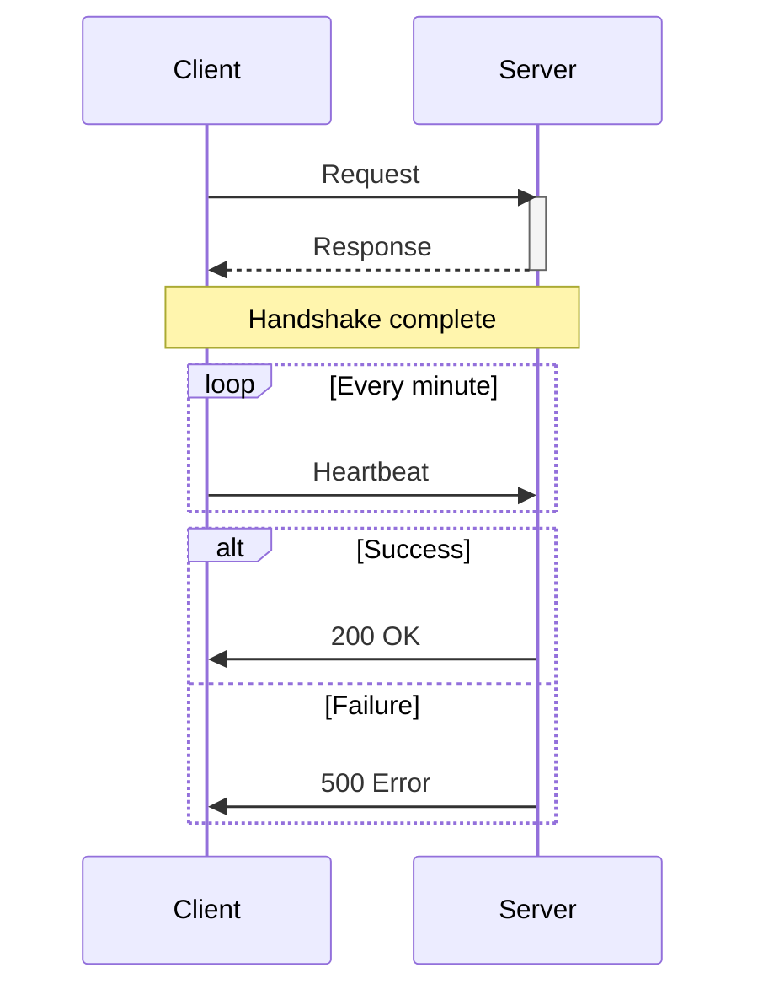
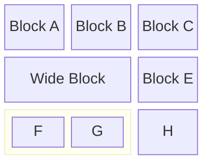
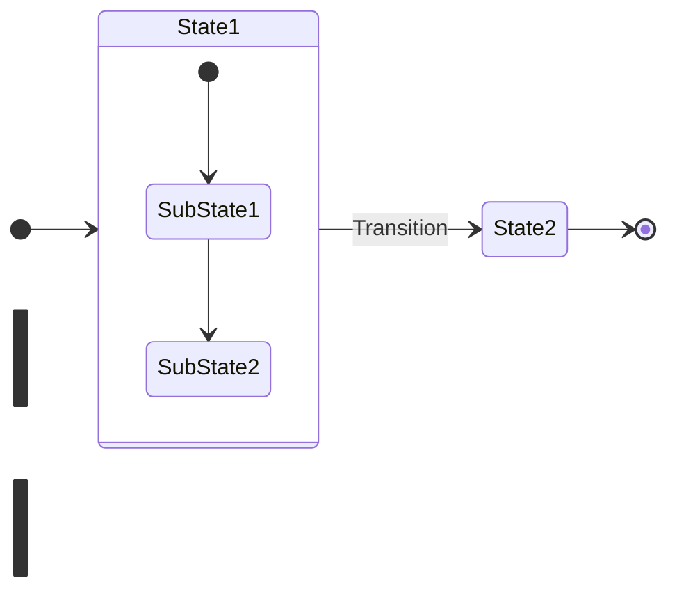
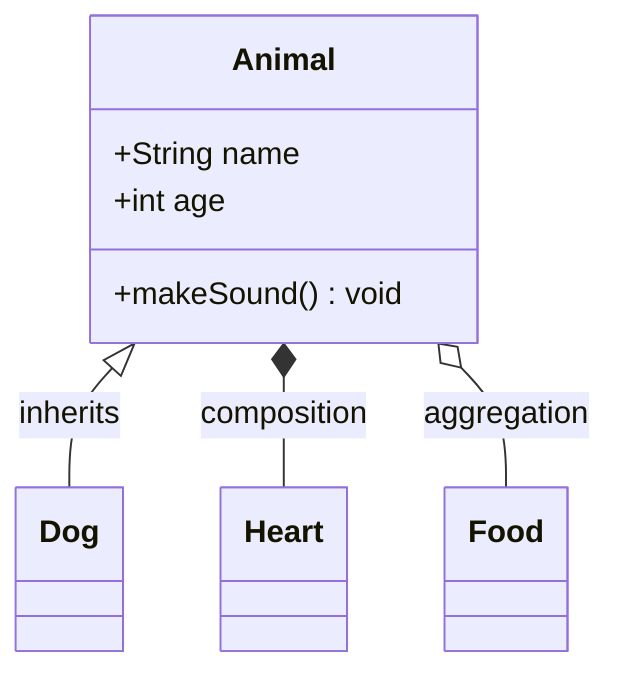

# Mermaid Diagram Expert

This skill provides expert guidance for creating Mermaid diagrams. When creating or converting diagrams to Mermaid format, follow these guidelines strictly.

## When to Use This Skill

Use this skill when:

- Creating any Mermaid diagram (flowchart, sequence, state, class, block-beta, gantt)
- Converting ASCII diagrams to Mermaid
- Fixing Mermaid syntax errors
- Choosing the appropriate diagram type for content

## Diagram Type Selection

Choose the most appropriate diagram type based on content:

| Content Type                              | Recommended Diagram |
| ----------------------------------------- | ------------------- |
| Process flows, architectures              | `flowchart`         |
| Protocol handshakes, message exchanges    | `sequenceDiagram`   |
| State machines, lifecycles                | `stateDiagram-v2`   |
| Class/struct relationships                | `classDiagram`      |
| Structured data layouts (packets, frames) | `block-beta`        |
| Timelines, schedules                      | `gantt`             |

## Flowchart Syntax

```mermaid
flowchart LR  %% Directions: TB, TD, BT, LR, RL
    A[Rectangle] --> B(Rounded)
    B --> C{Diamond}
    C -->|Yes| D[[Subroutine]]
    C -->|No| E[(Database)]

    subgraph Group["Group Title"]
        F[Node F]
        G[Node G]
    end
```

**Node Shapes:**

- `[text]` - Rectangle
- `(text)` - Rounded rectangle
- `([text])` - Stadium
- `[[text]]` - Subroutine
- `[(text)]` - Cylinder/Database
- `((text))` - Circle
- `{text}` - Diamond/Rhombus
- `{{text}}` - Hexagon
- `[/text/]` - Parallelogram
- `[\text\]` - Alt parallelogram
- `[/text\]` - Trapezoid
- `[\text/]` - Alt trapezoid

**Arrow Types:**

- `-->` - Arrow
- `---` - Line (no arrow)
- `-.->` - Dotted arrow
- `==>` - Thick arrow
- `--text-->` - Arrow with label
- `<-->` - Bidirectional

## Sequence Diagram Syntax



**Arrow Types:**

- `->>` - Solid line with arrowhead
- `-->>` - Dotted line with arrowhead
- `-x` - Solid line with cross
- `--x` - Dotted line with cross
- `-)` - Async solid
- `--)` - Async dotted

**Blocks:**

- `loop [text] ... end`
- `alt [text] ... else ... end`
- `opt [text] ... end`
- `par [text] ... and [text] ... end`
- `critical [text] ... option [text] ... end`

## Block-Beta Syntax (CRITICAL - READ CAREFULLY)



**CRITICAL SYNTAX RULES:**

1. Column span goes AFTER the node definition: `node["Label"]:2` NOT `node:2["Label"]`
2. Block groups: `block:groupId:columnSpan` then content, then `end`
3. Columns defined with `columns N` at the start
4. Arrows: `a --> b` or `a -- "label" --> b`

**Common Errors to AVOID:**

```
# WRONG - span before label
proto:2["Protocol"]

# CORRECT - span after label
proto["Protocol"]:2

# WRONG - mixed syntax
block:header:2
    columns 1
    title["Title"]
end

# CORRECT - proper nesting
block:header
    columns 1
    title["Title"]
end
```

## State Diagram Syntax



## Class Diagram Syntax



**Relationships:**

- `<|--` - Inheritance
- `*--` - Composition
- `o--` - Aggregation
- `-->` - Association
- `..>` - Dependency
- `..|>` - Realization

## Critical Rules

### General Rules

1. **Always validate syntax** - Test at https://mermaid.live if unsure
2. **Avoid "end" as text** - Use `[end]` or `"end"` if needed
3. **Use quotes for labels** - `["Label with spaces"]` is safer
4. **Prefer flowchart** - When in doubt, flowchart is most robust and forgiving
5. **Match content meaning** - The Mermaid diagram must convey the same information as the original

### Special Characters and Quotes

**Backslash escaping (`\"`) does NOT work in Mermaid!**

When node labels contain double quotes or special characters, **ALWAYS simplify the text**:

```
# WRONG - Backslash escape DOES NOT WORK
data["{\"filter\": \"active\"}"]

# WRONG - Single quotes are UNRELIABLE (fail in block-beta and some renderers)
data['{"filter": "active"}']

# CORRECT - ALWAYS simplify the text
data["JSON body"]
data["JSON request payload"]
data["Request data"]
```

**Priority of solutions:**

1. **Simplify text** - ALWAYS prefer descriptive text without special characters
2. **HTML entities** - Only if exact characters are critical: `#quot;` for `"`, `#amp;` for `&`
3. **Never use** - Backslash escapes `\"` or single quote delimiters `'...'`

**Other special characters to AVOID in labels:**

- `"` - Double quotes: simplify text instead
- `'` - Single quotes as delimiters: unreliable across renderers
- `#` - Hash: escape as `#35;` or avoid
- `&` - Ampersand: escape as `#amp;`
- `<` and `>` - Angle brackets: escape as `#lt;` and `#gt;`
- Backticks `` ` `` - Avoid completely
- `()` - Parentheses in flowcharts: see section below

### Parentheses in Flowchart Labels

**Parentheses inside flowchart node labels are interpreted as node shape syntax!**

```
# WRONG - Parentheses interpreted as rounded rectangle syntax
L4["Info about L4 (IP, ports, TCP)"]

# CORRECT - Remove parentheses or use alternative punctuation
L4["Info about L4: IP, ports, TCP"]
L4["Info about L4 - IP, ports, TCP"]
```

### Bidirectional Arrows with Labels

**Bidirectional arrows `<-->` with complex labels can fail!**

```
# WRONG - Complex label on bidirectional arrow
A <-->|mTLS (L4)<br/>Multiple lines| B

# CORRECT - Split into two separate arrows
A -->|mTLS L4| B
B -->|mTLS L4| A

# CORRECT - Simple label without special chars
A <-->|connection| B
```

**Rules for bidirectional arrows:**

1. Avoid parentheses in labels
2. Avoid multi-line labels with `<br/>`
3. Keep labels short and simple
4. When in doubt, split into two unidirectional arrows

## Converting ASCII Diagrams

When converting ASCII art to Mermaid:

1. **Identify the diagram type** - What is being represented?
2. **Extract nodes/entities** - List all boxes, shapes, participants
3. **Map relationships** - Identify arrows, connections, flow direction
4. **Preserve labels** - Keep all text labels and descriptions
5. **Choose appropriate type** - Select the Mermaid diagram that best represents the content
6. **Validate** - Ensure the meaning is preserved

## Error Handling

### Common Syntax Errors

| Error                   | Cause                        | Solution                           |
| ----------------------- | ---------------------------- | ---------------------------------- |
| Parse error at "end"    | Using "end" as label text    | Quote it: `["end"]`                |
| Unexpected token        | Special characters in labels | Simplify text or use HTML entities |
| Invalid node shape      | Parentheses in label         | Remove parentheses from labels     |
| Block-beta column error | Span before label            | Put span after: `node["Label"]:2`  |

### Debugging Steps

1. Start with minimal diagram
2. Add elements one at a time
3. Test at https://mermaid.live
4. Check for special characters in labels
5. Verify arrow syntax matches diagram type

## See Also

- Mermaid documentation: https://mermaid.js.org/
- Live editor: https://mermaid.live/
