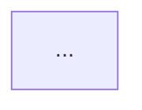

## Name
doc:controller-design

## Synopsis
```
/doc:controller-design
```

## Description
The `doc:controller-design` command analyzes a Kubernetes operator or controller codebase and generates comprehensive design documentation in a `DESIGN.md` file. It performs deep analysis of the controller-runtime implementation, identifying controllers, watches, reconciliation logic, resource relationships, and RBAC requirements.

This command is particularly useful for the following:
- Documenting existing Kubernetes operators for onboarding new team members.
- Understanding complex controller relationships and interactions.
- Generating architectural diagrams for design reviews.
- Creating technical documentation from actual implementation.
- Auditing controller permissions and resource access patterns.
- Analyzing controller behavior before making changes.

The command performs comprehensive analysis of the following:
- All controllers and their watched resources.
- Predicates, mapping functions, and indexes used by watches.
- Reconciliation logic and CRUD operations.
- Resource relationships between controllers.
- Custom Resource Definitions (CRDs).
- RBAC permissions and service account requirements.
- Entry points, commands, and subcommands.

## Implementation

This command uses the `controller-design` skill for detailed implementation. The process includes the following:

1. **Environment Setup**
   - Determine output location (docs/ directory if exists, otherwise top-level).
   - Load existing DESIGN.md if present (to preserve and amend content).
   - Create working directory for analysis artifacts.

2. **Codebase Analysis**
   - Scan source tree for controller-runtime patterns.
   - Identify all controller implementations.
   - Extract watch configurations, predicates, and indexes.
   - Analyze reconciliation functions for CRUD operations.
   - Map resource relationships between controllers.

3. **Diagram Generation**
   - Generate Mermaid flowchart for each controller.
   - Generate Mermaid sequence diagrams for multi-resource controllers.
   - Generate Mermaid class diagram showing all resource relationships.

4. **Manifest Analysis**
   - Parse CRDs from manifests/ directory.
   - Extract RBAC rules from manifests and embedded assets.
   - Document permissions and capabilities.

5. **Entry Point Analysis**
   - Identify main package and entry points.
   - Document commands and subcommands.
   - Extract CLI flags and configuration.

6. **Documentation Generation**
   - Synthesize all analysis into structured DESIGN.md.
   - Preserve existing content where applicable.
   - Generate comprehensive documentation with diagrams.

For detailed implementation steps, see `plugins/doc/skills/controller-design/SKILL.md`.

## Arguments
None. The command analyzes the current working directory.

## Return Value

- **Documentation File**: `DESIGN.md` (in docs/ if it exists, otherwise top-level).
- **Analysis Summary**: Number of controllers analyzed, resources identified, and diagrams generated.
- **Debug Files**: Raw analysis data in `.work/doc/controller-design/`.

## Output Format

The command generates a comprehensive markdown document:

```
DESIGN.md  (or docs/DESIGN.md)
```

### Document Structure

```markdown
# Project Design: <Project Name>

## Overview
- **Project Type**: Kubernetes Operator / Controller
- **Controllers**: <count>
- **Custom Resources**: <count>
- **Managed Resources**: <list>

## Architecture

### Controllers

#### Controller: <ControllerName>
**Reconciles**: <ResourceKind>

**Watches**:
- <Resource> (with <Predicate>)
- <Resource> (maps via <MappingFunc>)

**Indexes**:
- <IndexName> on <Field>

**Operations**:
- Creates: <resources>
- Reads: <resources>
- Updates: <resources>
- Deletes: <resources>

**Relationships**:
- Shares <resource> with <OtherController>

**Flowchart**:


**Sequence Diagram** (if multi-resource):
```mermaid
sequenceDiagram
    ...
```

### Resource Relationships

```mermaid
classDiagram
    ...
```

## Custom Resource Definitions

### <CRDName>
- **Group**: <group>
- **Version**: <version>
- **Kind**: <kind>
- **Scope**: <Namespaced|Cluster>
- **Description**: <description>

## RBAC Permissions

### ServiceAccount: <name>
**Permissions**:
- <resource>: <verbs>

## Entry Points

### Main Package
- **Path**: <path>
- **Commands**: <list>
```

## Examples

### Basic Usage

Generate design documentation for the current operator:
```
/doc:controller-design
```

The command will do the following:
1. Scan the current directory for controller code.
2. Analyze all controllers and resource relationships.
3. Generate Mermaid diagrams.
4. Parse CRDs and RBAC from manifests.
5. Create or update DESIGN.md (in docs/ or top-level).
6. Display summary of analysis.

### Example Output

```
🔍 Analyzing Kubernetes operator in current directory...

📂 Output location: docs/DESIGN.md (docs/ directory exists)
📄 Existing DESIGN.md found - will preserve and amend content

🎛️  Discovering controllers...
  ✓ Found 3 controllers:
    - DeploymentController (reconciles: Deployment)
    - ServiceController (reconciles: Service)
    - IngressController (reconciles: Ingress)

🔗 Analyzing watches and predicates...
  ✓ DeploymentController: 2 watches (Deployment, ConfigMap)
  ✓ ServiceController: 1 watch (Service)
  ✓ IngressController: 3 watches (Ingress, Service, Secret)

📊 Mapping resource relationships...
  ✓ DeploymentController reads ConfigMap (created by ServiceController)
  ✓ IngressController watches Service (created by ServiceController)

📐 Generating diagrams...
  ✓ 3 controller flowcharts
  ✓ 1 sequence diagram (IngressController - multi-resource)
  ✓ 1 class diagram (resource relationships)

📋 Analyzing manifests...
  ✓ Found 2 CRDs in manifests/crds/
  ✓ Found 3 RBAC definitions
  ✓ Extracted permissions for 2 service accounts

📝 Generating DESIGN.md...
  ✓ Controllers section (3 controllers)
  ✓ Resource relationships diagram
  ✓ CRD documentation (2 CRDs)
  ✓ RBAC summary (3 roles, 2 service accounts)
  ✓ Entry points (main + 2 subcommands)

✅ Documentation generated successfully!

📄 File: docs/DESIGN.md
📊 Summary:
  - Controllers: 3
  - Watched resources: 6 unique kinds
  - CRUD operations identified: 15
  - Mermaid diagrams: 5
  - Custom resources: 2
  - RBAC roles: 3
  - Documentation sections: 6
```

## Prerequisites

### Required Tools

The command works with standard Go tools and doesn't require external dependencies. However, for best results, ensure the following dependencies are met:

1. **Go toolchain** - For parsing Go source files.
   - Check: `go version`
   - Install: https://go.dev/doc/install

2. **Controller-runtime project** - The codebase should use sigs.k8s.io/controller-runtime.
   - Typical structure: controllers/, pkg/, manifests/, main.go

3. **Read access** - Permission to read source files and manifests in current directory

### Project Structure Assumptions

The command expects a standard Kubernetes operator structure:
```
.
├── main.go                    # Entry point
├── pkg/                       # Additional packages
│   └── operator/              # Manager and controller logic
│       └── controllers/       # Controller implementations
├── manifests/                 # CRDs and RBAC (optional)
│   ├── crds/
│   └── rbac/
└── docs/                      # Documentation (optional)
```

Alternative layouts are supported but may affect analysis accuracy.

## Best Practices

1. **Run from project root**: Execute the command from the top-level directory of your operator.
2. **Clean working directory**: Ensure that no stale build artifacts that might confuse analysis are present.
3. **Review generated content**: The documentation is a starting point - review and enhance it manually.
4. **Update regularly**: Re-run after significant controller changes to keep docs current.
5. **Commit to version control**: Keep DESIGN.md in Git for team visibility.
6. **Combine with code comments**: Generated docs complement (don't replace) inline documentation.

## Error Handling

Common scenarios handled by the command:

- **Not a controller project**: Warns if no controller-runtime patterns detected.
- **Missing manifests/**: Skips CRD/RBAC sections if manifests directory doesn't exist.
- **Ambiguous patterns**: Reports uncertainties and asks for manual verification.
- **Parse errors**: Continues analysis but reports files that couldn't be parsed.
- **Existing DESIGN.md**: Preserves and merges with existing content.

See `plugins/doc/skills/controller-design/SKILL.md` for detailed error handling.

## Performance Considerations

- **Time**: Analysis typically takes 30-60 seconds for medium-sized operators.
- **Complexity**: Large operators (10+ controllers) may take 2-3 minutes.
- **Memory**: Parsing large Go files may require adequate RAM.
- **Disk**: Generates temporary analysis files in `.work/doc/controller-design/`.

## See Also

- `openshift:crd-review` - Review CRD changes for API compatibility.
- `git:debt-scan` - Identify technical debt in the codebase.
- `utils:generate-test-plan` - Generate test plans for controllers.
- `doc:note` - Record engineering notes about design decisions.

## Technical Notes

### Controller Detection Strategy

The command identifies controllers by searching for the following:
1. Implementations of `reconcile.Reconciler` interface.
2. Calls to `ctrl.NewControllerManagedBy(mgr)` or `ctrl.New`.
3. Watch configurations via `.Watch()`, `.Watches()`, `.For()`, `.Owns()`.
4. Reconcile function signatures: `func (r *XReconciler) Reconcile(ctx context.Context, req reconcile.Request)`.

### Watch Analysis

For each controller, the command extracts the following:
- **Primary resource**: Identified from `.For()` or reconcile function signature.
- **Secondary resources**: Identified from `.Watch()`, `.Watches()`, and `.Owns()` calls.
- **Predicates**: Extracted from `WithEventFilter()` and predicate function calls.
- **Mapping functions**: Identified from custom event handlers.
- **Indexes**: Found via `mgr.GetFieldIndexer().IndexField()` calls.

### CRUD Operation Detection

The command identifies operations by searching for:
- **Create**: `client.Create()`, `clientset.Create()`
- **Read**: `client.Get()`, `cache.Get()`, `client.List()`, `cache.List()`, `lister.Get()`, `lister.List()`
- **Update**: `client.Update()`, `client.Patch()`, `client.Status().Update()`
- **Delete**: `client.Delete()`, `DeleteAllOf()`

### Relationship Mapping

Controllers and resources are considered related in each of the following cases:
1. Two controllers watch the same resource.
2. Two controllers modify the same resource type.
3. One controller reads a resource that another creates or updates.
4. One resource has an owner reference on another.

### Diagram Generation

**Flowcharts**: Show reconciliation flow with decision points, error handling, and operations.
**Sequence diagrams**: Show temporal interactions between controller and multiple resources.
**Class diagrams**: Show resource schemas, relationships, and ownership hierarchies.
