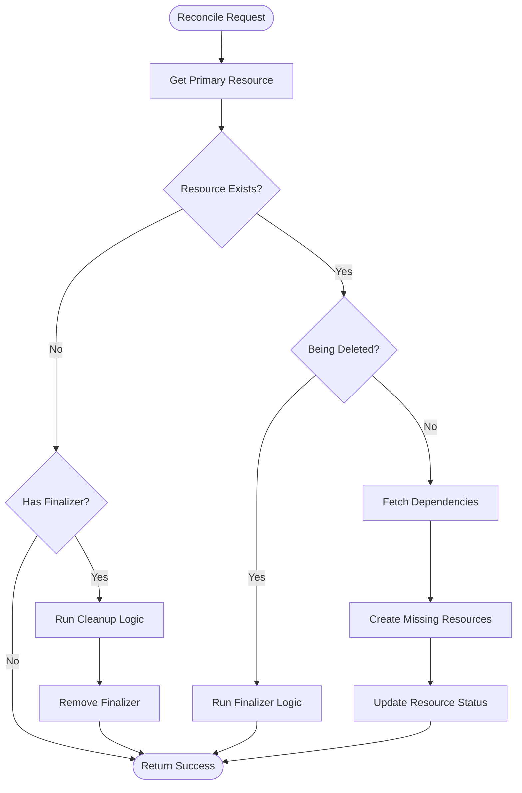

# Controller Design Documentation Generator

This skill provides detailed step-by-step implementation guidance for the `/doc:controller-design` command, which analyzes a Kubernetes operator or controller codebase and generates comprehensive design documentation.

**IMPORTANT FOR AI**: This is a **procedural skill** - when invoked, you should directly execute the implementation steps defined in this document. Do NOT look for or execute external scripts. Follow the step-by-step instructions below, starting with Step 1.

## When to Use This Skill

This skill is automatically invoked by the `/doc:controller-design` command and should not be called directly by users.

## Prerequisites

- Working directory contains a Kubernetes operator or controller project.
- Project uses controller-runtime (sigs.k8s.io/controller-runtime).
- Go toolchain is installed (for best results when parsing complex code).
- Current user has read permissions for all source files and manifests.

## Implementation Steps

### Step 1: Environment Setup and Initialization

**Objective**: Set up the working environment and determine output locations.

**Actions**:

1. **Save initial directory**: Store current directory for later use
   ```bash
   INITIAL_DIR=$(pwd)
   ```

2. **Determine output location**:
   - Check if `docs/` directory exists: `[[ -d docs ]]`.
   - If exists: `OUTPUT_FILE=$INITIAL_DIR/docs/DESIGN.md`.
   - If not exists: `OUTPUT_FILE=$INITIAL_DIR/DESIGN.md`.

3. **Check for existing DESIGN.md**:
   - If `$OUTPUT_FILE` exists, read it and store content in memory.
   - Set flag `PRESERVE_EXISTING=true`.
   - Extract existing sections to preserve existing content.

4. **Create working directory**:
   ```bash
   WORK_DIR=$INITIAL_DIR/.work/doc/controller-design
   mkdir -p "$WORK_DIR"
   ```

5. **Initialize data structures**:
   - Create empty lists for the following: controllers, resources, watches, CRDs, RBAC rules.
   - Create relationship map for tracking resource interactions.

6. **Display progress**:
   ```
   🔍 Analyzing Kubernetes operator in: $INITIAL_DIR
   📂 Output location: $OUTPUT_FILE
   ```

### Step 2: Discover Controllers

**Objective**: Identify all controller implementations in the codebase.

**Detection Strategy**:

Search for controller-runtime patterns in Go source files:

1. **Find all Go files in typical controller locations**:
   ```bash
   shopt -s extglob globstar; ls -1 pkg/(operator|controller)/**/*.go > "$WORK_DIR/go-files.txt"
   ```
   If no matches, expand search:
   ```bash
   shopt -s extglob globstar; ls -1 !(vendor)/**/*.go > "$WORK_DIR/go-files.txt"
   ```

2. **For each Go file, search for controller patterns**:

   **Pattern 1: Reconciler interface implementation**
   ```bash
   grep -l -e '^func .* Reconcile.*Request.*Result.*error.*$' -- {file}
   ```

   **Pattern 2: Controller setup function**
   ```bash
   grep -l -e 'NewControllerManagedBy\|\.New(mgr' -- {file}
   ```

   **Pattern 3: Reconciler struct definition**
   ```bash
   grep -l -e '^type.*[rR]econciler struct {$' -- {file}
   ```

3. **For each identified controller file**:
   - Extract controller name from struct definition.
   - Extract package path.
   - Extract the type of resource that the controller reconciles.
   - Store them in `$WORK_DIR/controllers.json`:
     ```json
     {
       "name": "{name}",
       "file": "{path}",
       "reconciler_type": "{type}"
     }
     ```

4. **Display progress**:
   ```
   🎛️  Discovered 3 controllers:
     - DeploymentController
     - ServiceController
     - IngressController
   ```

**Error Handling**:
- If no controllers found, warn: "No controller-runtime patterns detected. Is this a Kubernetes operator?"
- Continue anyway (might be non-standard structure).

### Step 3: Analyze Watches and Predicates

**Objective**: For each controller, identify what resources it watches and any predicates or mapping functions.

**Actions**:

For each controller from Step 2:

1. **Find the controller setup function**:
   - Look for function containing `NewControllerManagedBy`.
   - Common names: `SetupWithManager`, `Setup`, `Add`.

2. **Extract primary resource** (what the controller reconciles):
   - Look for `.For(&v1.ResourceKind{})`.
   - Alternative: Extract from Reconcile function signature or comments.
   - Store as `reconciles: ResourceKind`.

3. **Extract secondary watches**:

   **Pattern: `.Watches()` calls**
   ```go
   Watches(&source.Kind{Type: &corev1.ConfigMap{}}, ...)
   ```
   or
   ```go
   Watch(source.Kind[client.Object](..., &corev1.ConfigMap{}, ...))
   ```
   Extract resource kind and any event handler.

   **Pattern: `.Owns()` calls**
   ```go
   Owns(&appsv1.Deployment{})
   ```
   Extract owned resource kind.

   **Pattern: Custom watch with handler**
   ```go
   Watches(&source.Kind{Type: &corev1.Secret{}},
           handler.EnqueueRequestsFromMapFunc(r.mapSecretToDeployment))
   ```
   or
   ```go
   Watch(source.Kind[client.Object](..., &corev1.Secret{},
           handler.EnqueueRequestsFromMapFunc(r.mapSecretToDeployment), ...))
   ```
   Extract resource kind AND mapping function name.

4. **Extract predicates** (event filters):
   ```go
   WithEventFilter(predicate.GenerationChangedPredicate{})
   ```
   Look for:
   - `WithEventFilter()`.
   - `NewPredicateFuncs()`.
   - Custom predicate implementations.

5. **Extract field indexes**:
   ```go
   mgr.GetFieldIndexer().IndexField(ctx, &v1.Pod{}, "spec.nodeName", ...)
   ```
   Look for `IndexField()` calls associated with this controller.

6. **Store watch data** in `$WORK_DIR/controller-{name}-watches.json`:
   ```json
   {
     "controller": "DeploymentController",
     "reconciles": "Deployment",
     "watches": [
       {
         "resource": "ConfigMap",
         "type": "owns",
         "predicate": null,
         "mapping_func": null
       },
       {
         "resource": "Secret",
         "type": "watches",
         "predicate": null,
         "mapping_func": "mapSecretToDeployment"
       }
     ],
     "indexes": [
       {
         "resource": "Pod",
         "field": "spec.nodeName",
         "index_name": "nodeName"
       }
     ]
   }
   ```

7. **Display progress**:
   ```
   🔗 Analyzing watches and predicates...
     ✓ DeploymentController: 2 watches (Deployment, ConfigMap)
   ```

**Important Patterns to Recognize**:

- **Owner references**: `.Owns()` implies the controller creates and manages that resource.
- **Mapping functions**: `EnqueueRequestsFromMapFunc` means controller reacts to changes in related resources.
- **Predicates**: Filter which events trigger reconciliation.
- **Indexes**: Speed up lookups, indicate important query patterns.

### Step 4: Analyze Reconciliation Logic and CRUD Operations

**Objective**: Determine what resources each controller creates, reads, updates, or deletes.

**Actions**:

For each controller:

1. **Find the Reconcile function**:
   ```go
   func (r *DeploymentReconciler) Reconcile(ctx context.Context, req reconcile.Request) (reconcile.Result, error)
   ```

2. **Search for client operations** within the Reconcile function and helper functions:

   **Create operations**:
   ```bash
   grep -n -e 'client\.Create\|clientset.*\.Create' -- {file}
   ```
   Look for patterns:
   - `r.client.Create(ctx, &obj)`
   - `r.clientset.CoreV1().Pods(ns).Create(ctx, pod, metav1.CreateOptions{})`

   **Read operations**:
   ```bash
   grep -n -e 'client\.Get\|client\.List\|lister\.Get\|lister\.List' -- {file}
   ```
   Look for patterns:
   - `r.client.Get(ctx, req.NamespacedName, &obj)`
   - `r.cache.Get(ctx, req.NamespacedName, &obj)`
   - `r.client.List(ctx, &list, client.MatchingLabels{...})`
   - `r.cache.List(ctx, &list, client.MatchingLabels{...})`

   **Update operations**:
   ```bash
   grep -n -e 'client\.Update\|client\.Patch\|Status()\.Update' -- {file}
   ```
   Look for patterns:
   - `r.client.Update(ctx, &obj)`
   - `r.client.Status().Update(ctx, &obj)`
   - `r.client.Patch(ctx, &obj, patch)`

   **Delete operations**:
   ```bash
   grep -n -e 'client\.Delete\|DeleteAllOf' -- {file}
   ```
   Look for patterns:
   - `r.client.Delete(ctx, &obj)`
   - `r.client.DeleteAllOf(ctx, &corev1.Pod{}, ...)`

3. **Extract resource types from operations**:
   - For each operation, identify the resource type from the object reference.
   - Example: `&corev1.ConfigMap{}` → creates ConfigMap.
   - Example: `&appsv1.Deployment{}` → updates Deployment.

4. **Store CRUD data** in `$WORK_DIR/controller-{name}-crud.json`:
   ```json
   {
     "controller": "DeploymentController",
     "operations": {
       "creates": ["ReplicaSet", "Pod"],
       "reads": ["Deployment", "ConfigMap", "Service"],
       "updates": ["Deployment", "ReplicaSet"],
       "deletes": ["Pod"]
     }
   }
   ```

5. **Identify patterns and logic flows**:
   - Error handling patterns
   - Requeue logic
   - Finalizers usage
   - Status updates
   - Status conditions set

**Important Details to Capture**:

- **Conditional creates**: If resource only created under certain conditions.
- **Status updates**: Separate from spec updates.
- **Finalizers**: Indicates cleanup logic.
- **Owner references**: Resources created with owner refs (for garbage collection and for representing logical relationships between resources).

### Step 5: Map Controller Relationships

**Objective**: Identify relationships between controllers based on shared resources.

**Actions**:

1. **Build resource access matrix**:
   Create a map showing which controllers access which resources and how:
   ```
   Resource       | Controller A | Controller B | Controller C
   ---------------|--------------|--------------|-------------
   Deployment     | Reconciles   | Reads        | -
   ConfigMap      | Creates      | Reads        | Watches
   Service        | -            | Reconciles   | Reads
   ```

2. **Identify relationship types**:

   **Type 1: Shared resource**
   - Both controllers watch the same resource.
   - Relationship: "Both DeploymentController and IngressController watch Service".

   **Type 2: Create-read relationship**
   - One controller creates a resource, and another reads it.
   - Relationship: "ServiceController reads ConfigMap created by DeploymentController".

   **Type 3: Update conflict potential**
   - Multiple controllers update the same resource.
   - Relationship: "⚠️ Both DeploymentController and PodController update Deployment status"

   **Type 4: Owner-dependent relationship**
   - One controller creates resource with owner reference to a resource that another controller reads.
   - Relationship: "DeploymentController creates ReplicaSet owned by Deployment (reconciled by DeploymentController)".

3. **Store relationships** in `$WORK_DIR/relationships.json`:
   ```json
   {
     "relationships": [
       {
         "type": "shared-watch",
         "resource": "Service",
         "controllers": ["DeploymentController", "IngressController"],
         "description": "Both controllers react to Service changes"
       },
       {
         "type": "create-read",
         "resource": "ConfigMap",
         "creator": "DeploymentController",
         "reader": "ServiceController",
         "description": "ServiceController reads ConfigMap created by DeploymentController"
       }
     ]
   }
   ```

4. **Display findings**:
   ```
   📊 Mapping resource relationships...
     ✓ Found 2 shared watches
     ✓ Found 3 create-read relationships
     ⚠️  Warning: Potential update conflict on Deployment
   ```

**Relationship Analysis Tips**:

- Shared watches often indicate coordination between controllers.
- Create-read relationships show data flow.
- Multiple updaters may indicate race conditions or conflicts (flag for review).
- Owner references create garbage collection relationships.

### Step 6: Generate Mermaid Diagrams

**Objective**: Create visual representations of controller behavior and relationships.

**Actions**:

#### 6.1: Generate Flowchart for Each Controller

For each controller, create a flowchart showing reconciliation flow:

**Template**:


**Generation logic**:
1. Start with reconcile request.
2. Add decision points for the following:
   - Resource existence check.
   - Deletion timestamp check.
   - Finalizer handling.
   - Dependency checks.
3. Add operation nodes for the following:
   - Each create operation.
   - Each update operation.
   - Each delete operation.
   - Status updates.
4. Add error paths and requeue logic.
5. End with return statement.

Store in `$WORK_DIR/diagram-{controller}-flow.mmd`.

#### 6.2: Generate Sequence Diagram for Multi-Resource Controllers

For controllers that interact with 3+ resources, create a sequence diagram:

**Template**:


**Generation logic**:
1. Add participant for reconciler.
2. Add participant for each resource the controller interacts with.
3. For each operation in reconcile flow, do the following:
   - Add an arrow for operation (get, create, update, delete).
   - Add a return arrow for result.
4. Order operations based on code flow analysis.

Store in `$WORK_DIR/diagram-{controller}-sequence.mmd`.

**Skip** if controller only interacts with 1-2 resources.

#### 6.3: Generate Class Diagram for All Resources

Create a single class diagram showing relationships between ALL resources across ALL controllers:

**Template**:


**Generation logic**:
1. For each unique resource across all controllers, do the following:
   - Add class node with resource name.
   - Add key fields if identifiable from code or CRDs.
2. For each relationship identified in Step 5, do the following:
   - Add relationship arrow with cardinality.
   - Label with relationship type (owns, references, watches).
3. Use relationship types:
   - `-->` for ownership (has owner reference).
   - `..>` for reference (referenced by name/label).
   - `--o` for composition.

Store in `$WORK_DIR/diagram-resources-class.mmd`.

**Display progress**:
```
📐 Generating diagrams...
  ✓ 3 controller flowcharts
  ✓ 1 sequence diagram
  ✓ 1 resource class diagram
```

### Step 7: Analyze Custom Resource Definitions (CRDs)

**Objective**: Extract and document all CRDs defined by the operator.

**Actions**:

1. **Find CRD manifests**:
   ```bash
   shopt -s extglob globstar; grep -l -e 'kind: CustomResourceDefinition' -e '"kind": "CustomResourceDefinition"' -- !(vendor)/**/*.@(yaml|yml|json) > "$WORK_DIR/crd-files.txt"
   ```

   Common locations:
   - `manifests/crds/`
   - `config/crd/`
   - `deploy/crds/`
   - `charts/*/crds/`

2. **For each CRD file**:

   Parse YAML and extract the following fields:
   - `metadata.name`
   - `spec.group`
   - `spec.names.kind`
   - `spec.names.plural`
   - `spec.scope` (Namespaced or Cluster)
   - `spec.versions[*].name`
   - `spec.versions[*].schema` (for key fields)

3. **Extract meaningful description**:
   - Check for `description` field in OpenAPI schema.
   - Look for code comments in corresponding Go types.
   - Infer from field names and structure.

4. **Identify version differences**:
   - If multiple versions, note what changed between versions.
   - Check for storage version.

5. **Store CRD data** in `$WORK_DIR/crds.json`:
   ```json
   {
     "crds": [
       {
         "name": "deployments.example.com",
         "group": "example.com",
         "kind": "Deployment",
         "plural": "deployments",
         "scope": "Namespaced",
         "versions": ["v1", "v1beta1"],
         "storage_version": "v1",
         "description": "Deployment manages application deployments",
         "key_fields": {
           "spec.replicas": "integer",
           "spec.selector": "LabelSelector",
           "spec.template": "PodTemplateSpec"
         }
       }
     ]
   }
   ```

6. **Cross-reference with controllers**:
   - Match CRD kinds with reconciled resources from Step 3.
   - Note which controller manages which CRD.

**Display progress**:
```
📋 Analyzing Custom Resource Definitions...
  ✓ Found 2 CRDs in manifests/crds/
  ✓ Matched with controllers
```

**Error Handling**:
- If no manifests/ directory exists: Skip this step and note in output.
- If some CRD file is malformed: Log warning, and continue with other CRDs.
- If cannot parse YAML: Try JSON format.

### Step 8: Extract RBAC Permissions

**Objective**: Document all RBAC rules and permissions required by the operator.

**Actions**:

1. **Find RBAC manifests**:
   ```bash
   shopt -s extglob globstar; grep -l -e 'kind: \(ClusterRole\|Role\)' -e '"kind": "\(ClusterRole\|Role\)"' !(vendor)/**/*.@(yaml|yml|json) > "$WORK_DIR/rbac-files.txt"
   ```

   Common locations:
   - `manifests/rbac/`
   - `config/rbac/`
   - `deploy/`
   - Embedded in Go code as raw strings.

2. **Search embedded RBAC in Go code**:
   ```bash
   shopt -s extglob globstar; grep -r -e 'kind: \(ClusterRole\|Role\)' -e '"kind": "\(ClusterRole\|Role\)"' -- !(vendor)/**/*.go >> "$WORK_DIR/rbac-files.txt"
   ```

3. **For each RBAC manifest**:

   Parse and extract:
   - Role/ClusterRole name
   - Rules: apiGroups, resources, verbs
   - Associated ServiceAccount (from RoleBinding/ClusterRoleBinding)

4. **Organize by ServiceAccount**:
   ```json
   {
     "rbac": [
       {
         "service_account": "deployment-controller",
         "namespace": "default",
         "roles": [
           {
             "name": "deployment-controller-role",
             "type": "ClusterRole",
             "rules": [
               {
                 "apiGroups": ["apps"],
                 "resources": ["deployments"],
                 "verbs": ["get", "list", "watch", "create", "update", "patch", "delete"]
               },
               {
                 "apiGroups": [""],
                 "resources": ["configmaps"],
                 "verbs": ["get", "list"]
               }
             ]
           }
         ]
       }
     ]
   }
   ```

5. **Summarize permissions**:
   Group by resource type and list all verbs:
   ```
   ServiceAccount: deployment-controller
     - deployments (apps): get, list, watch, create, update, patch, delete
     - configmaps: get, list
     - services: get, list, watch, update
   ```

6. **Validate against code**:
   - Compare RBAC rules with CRUD operations from Step 4.
   - **Flag mismatches**:
     - Code creates Pods but has no create permission on Pods.
     - RBAC allows delete on ConfigMaps, but code never deletes them.
   - Store validation results.

**Display progress**:
```
🔐 Analyzing RBAC permissions...
  ✓ Found 3 Roles, 2 ClusterRoles
  ✓ Mapped to 2 ServiceAccounts
  ⚠️  Warning: Code creates Pods but no create permission found
```

**Important**:
- Look for namespace-scoped versus cluster-scoped permissions.
- Check for wildcard permissions (`*`) - flag as security concern.
- Validate permissions are minimal (principle of least privilege).

### Step 9: Analyze Entry Points and Commands

**Objective**: Document the main entry point, commands, subcommands, and configuration.

**Actions**:

1. **Find main package**:
   ```bash
   find . -name "main.go" | head -n 1
   ```

2. **Analyze `main.go`**:

   **Extract imports**: Look for CLI frameworks.
   - `github.com/spf13/cobra` → Cobra commands.
   - `github.com/urfave/cli` → Urfave CLI.
   - `flag` package → Standard flags.
   - `sigs.k8s.io/controller-runtime` → Manager setup.

3. **Identify command structure**:

   **If using Cobra**:
   ```go
   rootCmd := &cobra.Command{
     Use:   "myoperator",
     Short: "Kubernetes operator for...",
   }
   rootCmd.AddCommand(controllerCmd)
   rootCmd.AddCommand(webhookCmd)
   ```
   Extract the following:
   - Root command name and description.
   - All subcommands via `AddCommand()`

   **If using standard flags**:
   ```go
   flag.String("metrics-addr", ":8080", "Metrics server address")
   flag.Bool("enable-webhooks", false, "Enable webhooks")
   ```
   Extract all flags, types, defaults, descriptions.

4. **Identify manager setup**:
   ```go
   mgr, err := ctrl.NewManager(ctrl.GetConfigOrDie(), ctrl.Options{
     Scheme:                 scheme,
     MetricsBindAddress:     metricsAddr,
     Port:                   9443,
     HealthProbeBindAddress: probeAddr,
   })
   ```
   Extract manager options.  Note any leader election configuration.

5. **Find controller registration**:
   ```go
   if err = (&controllers.DeploymentReconciler{
     Client: mgr.GetClient(),
     Scheme: mgr.GetScheme(),
   }).SetupWithManager(mgr); err != nil {
   ```
   List all controllers registered with manager.

6. **Store entry point data**:
   ```json
   {
     "entry_point": {
       "main_file": "cmd/manager/main.go",
       "binary_name": "myoperator",
       "commands": [
         {
           "name": "controller",
           "description": "Run controller manager",
           "flags": [
             {
               "name": "metrics-addr",
               "type": "string",
               "default": ":8080",
               "description": "Metrics server address"
             }
           ]
         },
         {
           "name": "webhook",
           "description": "Run webhook server"
         }
       ],
       "controllers_registered": [
         "DeploymentReconciler",
         "ServiceReconciler"
       ]
     }
   }
   ```

**Display progress**:
```
🚀 Analyzing entry points...
  ✓ Main package: cmd/manager/main.go
  ✓ Binary name: myoperator
  ✓ Commands: controller, webhook
  ✓ Controllers registered: 3
```

### Step 10: Generate DESIGN.md Documentation

**Objective**: Synthesize all analysis into a comprehensive `DESIGN.md` file.

**Actions**:

1. **Load existing DESIGN.md** (if the `PRESERVE_EXISTING` flag is set):
   - Parse existing sections.
   - Identify which sections are custom (added by user).
   - Preserve custom sections.

2. **Generate document structure**:

```markdown
# Project Design: {ProjectName}

{If existing overview exists, preserve it; otherwise generate:}
## Overview
- **Project Type**: Kubernetes Operator
- **Controllers**: {count}
- **Custom Resources**: {count}
- **Managed Resources**: {list all resource kinds}
- **Binary Name**: {from step 9}

## Architecture

### Controllers

{For each controller from Step 2-4:}
#### Controller: {ControllerName}

**File**: `{filepath}`

**Reconciles**: `{PrimaryResource}`

**Watches**:
- `{Resource}` (primary resource)
{If has secondary watches:}
- `{Resource}` (owned - created with owner reference)
- `{Resource}` (watches with predicate: {PredicateName})
- `{Resource}` (maps via: {MappingFuncName})

{If has indexes:}
**Indexes**:
- `{IndexName}` on `{Resource}.{Field}`

**Operations**:
- **Creates**: {list of resources}
- **Reads**: {list of resources}
- **Updates**: {list of resources}
- **Deletes**: {list of resources}

{If has relationships from Step 5:}
**Relationships**:
- Shares `{Resource}` with `{OtherController}` (both watch)
- Reads `{Resource}` created by `{OtherController}`

{If has finalizers:}
**Finalizers**: `{finalizerName}`

{Include flowchart from Step 6.1:}
**Reconciliation Flow**:
```mermaid
{paste flowchart from $WORK_DIR/diagram-{controller}-flow.mmd}
```

{If sequence diagram exists from Step 6.2:}
**Resource Interactions**:
```mermaid
{paste sequence diagram from $WORK_DIR/diagram-{controller}-sequence.mmd}
```

---

{Repeat for all controllers}

### Resource Relationships

This diagram shows how all resources relate across all controllers:

```mermaid
{paste class diagram from $WORK_DIR/diagram-resources-class.mmd}
```

## Custom Resource Definitions

{For each CRD from Step 7:}
### {Kind}

- **API Group**: `{group}`
- **Versions**: {list versions, mark storage version}
- **Scope**: {Namespaced|Cluster}
- **Plural Name**: `{plural}`
- **Description**: {description}

**Key Fields**:
- `{fieldPath}`: {type} - {description}
{repeat for important fields}

**Managed By**: `{ControllerName}` controller

---

{If no CRDs found:}
## Custom Resource Definitions

No CRDs found in this project. This operator manages built-in Kubernetes resources.

## RBAC Permissions

{For each ServiceAccount from Step 8:}
### ServiceAccount: `{name}`

**Namespace**: `{namespace}`

**Permissions**:

| API Group | Resource | Verbs |
|-----------|----------|-------|
| `{apiGroup}` | `{resource}` | {comma-separated verbs} |
{repeat for each rule}

{If validation warnings exist:}
**⚠️ Validation Warnings**:
- Code creates `{Resource}`, but no create permission was found in RBAC.
- RBAC allows delete on `{Resource}`, but code never deletes it.

---

{If no RBAC found:}
## RBAC Permissions

No RBAC manifests found. Ensure proper permissions are configured for this operator.

## Entry Points

{From Step 9:}
### Main Package

**File**: `{mainFile}`
**Binary**: `{binaryName}`

{If has subcommands:}
### Commands

#### `{commandName}`
{description}

**Flags**:
- `--{flagName}` ({type}, default: `{default}`): {description}
{repeat for each flag}

{If only single entry point:}
**Flags**:
- `--{flagName}` ({type}, default: `{default}`): {description}
{repeat for each flag}

**Controllers Registered**:
{list controllers registered in main}

## Configuration

{If found config file or ConfigMap:}
The operator can be configured via the following:
- Environment variables.
- Command-line flags (see above).
- ConfigMap: `{configMapName}`.

{Otherwise:}
Configuration is managed via command-line flags (see Entry Points section).

---

{If existing DESIGN.md had custom sections, append them here}

## Notes

This document was generated by `/doc:controller-design` on {date}.
For implementation details, see the source code referenced throughout this document.
```

3. **Write to output file**:
   ```bash
   cat > "$OUTPUT_FILE" << 'EOF'
   {generated content}
   EOF
   ```

4. **Display completion**:
   ```
   ✅ Documentation generated successfully!

   📄 File: {OUTPUT_FILE}
   📊 Summary:
     - Controllers: {count}
     - Watched resources: {count} unique kinds
     - CRUD operations: {count}
     - Mermaid diagrams: {count}
     - Custom resources: {count}
     - RBAC roles: {count}
     - Documentation sections: {count}
   ```

**Important**:
- Use clear, consistent formatting.
- Link to source files with relative paths.
- Keep diagrams readable (don't overcomplicate).
- Preserve any existing custom sections.
- Add generation timestamp.

### Step 11: Validation and Cleanup

**Objective**: Validate generated documentation, and clean up temporary files.

**Actions**:

1. **Validate generated DESIGN.md**:
   - Check file was created successfully.
   - Verify file size > 0.
   - Check all diagrams have valid Mermaid syntax.

2. **Validate Mermaid syntax**:
   For each diagram, check for the following:
   - Opening and closing code fence.
   - Valid Mermaid keywords (flowchart, sequenceDiagram, classDiagram).
   - Balanced parentheses and brackets.
   - No syntax errors.

3. **Run consistency checks**:
   - All controllers mentioned in overview are documented.
   - All CRDs have corresponding controllers.
   - All RBAC permissions match CRUD operations.
   - No broken links to source files.

4. **Generate summary report**:
   Create `$WORK_DIR/analysis-summary.txt`:
   ```
   Controller Design Analysis Summary
   ===================================

   Date: {timestamp}
   Project: {projectName}
   Output: {outputFile}

   Controllers Found: {count}
   {list controller names}

   Resources Managed: {count}
   {list resource kinds}

   CRDs Defined: {count}
   {list CRD kinds}

   RBAC Roles: {count}
   ServiceAccounts: {count}

   Diagrams Generated: {count}
   - Flowcharts: {count}
   - Sequence diagrams: {count}
   - Class diagrams: 1

   Warnings:
   {list any warnings from analysis}

   Files Created:
   - {outputFile}
   - {workDir}/analysis-summary.txt
   ```

5. **Preserve working directory** (don't delete):
   - Keep all JSON files for debugging.
   - Keep diagram source files.
   - User may want to inspect raw analysis data.

6. **Display final message**:
   ```
   ✅ Design documentation complete!

   📄 Documentation: {outputFile}
   🔍 Analysis data: {workDir}

   Next steps:
   - Review the generated DESIGN.md.
   - Customize sections as needed.
   - Commit to version control.
   ```

## Error Handling

### Common Errors and Solutions

1. **No controllers found**
   - **Cause**: Not a controller-runtime project, or non-standard structure.
   - **Solution**:
     - Warn user, and ask if this is a Kubernetes operator.
     - Attempt broader search patterns.
     - Allow manual specification of controller files.

2. **Cannot parse Go files**
   - **Cause**: Complex syntax, build tags, or missing dependencies.
   - **Solution**:
     - Use regex patterns instead of full parsing.
     - Log which files couldn't be parsed.
     - Continue with files that can be parsed.

3. **Mermaid diagram too complex**
   - **Cause**: Controller reconciles 10+ resources.
   - **Solution**:
     - Simplify diagram by grouping similar operations.
     - Split into multiple diagrams.
     - Provide text summary as fallback.

4. **RBAC validation failures**
   - **Cause**: Mismatched permissions versus code operations.
   - **Solution**:
     - Include warnings in output (not errors).
     - Suggest which permissions may be missing.
     - Note that analysis may not catch dynamic permissions.

5. **Existing DESIGN.md has conflicts**
   - **Cause**: User customizations clash with generated sections.
   - **Solution**:
     - Preserve user sections under "Custom Notes".
     - Add "GENERATED" markers to auto-generated sections.
     - Prompt user to review and merge manually.

6. **No manifests/ directory**
   - **Cause**: CRDs and RBAC defined elsewhere (e.g., Helm charts).
   - **Solution**:
     - Check alternative locations: config/, deploy/, charts/.
     - Note in documentation where manifests should be.
     - Skip those sections if truly not found.

### Validation Warnings

Include these warnings in output when detected:

- **⚠️ Potential permission mismatch**: Code performs operation without RBAC permission.
- **⚠️ Unused permission**: RBAC allows operation never performed in code.
- **⚠️ Update conflict**: Multiple controllers update same resource.
- **⚠️ Missing CRD**: Controller reconciles resource without CRD definition.
- **⚠️ Unregistered controller**: Controller struct found but not registered in main.
- **⚠️ Complex reconciliation**: Controller logic exceeds 500 lines (maintainability concern).

## Best Practices for Implementation

### Code Parsing Strategy

**Prefer lightweight parsing**:
- Use grep/sed for pattern matching when possible.
- Only parse Go AST if absolutely necessary.
- Regex patterns are faster and more reliable for this use case.

**Be resilient to variations**:
- Controller-runtime has many ways to express the same thing.
- Support both old and new API styles.
- Handle vendor/ and go.mod dependencies gracefully.

### Diagram Generation Tips

**Keep diagrams simple**:
- Maximum 12 nodes per flowchart.
- Maximum 8 participants in sequence diagrams.
- Group similar operations together.
- Use subgraphs for complex sections.

**Mermaid syntax quirks**:
- Avoid special characters in node IDs (use alphanumeric only).
- Use quotes for labels with spaces.
- Test that generated diagrams render correctly.

### Documentation Quality

**Be specific**:
- Link to exact file and line numbers when possible.
- Use actual code examples, not pseudo-code.
- Cite specific functions and types.

**Be concise**:
- Don't repeat information available in code comments.
- Summarize, don't transcribe.
- Focus on architecture and relationships, not implementation details.

**Be honest about limitations**:
- Note where analysis is uncertain.
- Mark inferred versus explicit relationships.
- Warn about complex patterns that may not be fully captured.

## Advanced Scenarios

### Multi-Repository Operators

If operator spans multiple repositories, do the following:
- Analyze only the current repository.
- Note dependencies on external controllers.
- Include references to other repositories.

### Operators with Webhooks

If any webhooks are detected:
- Add a "Webhooks" section documenting the following:
  - Validating webhooks.
  - Mutating webhooks.
  - Resources they validate or mutate.
- Show webhook calls in sequence diagrams.

### Operators with Multiple Managers

If multiple manager instances are found, do the following:
- Document each manager separately.
- Show which controllers run in which manager.

### Operators Using Custom Clients

If not using controller-runtime client, do the following:
- Detect clientset usage.
- Look for raw REST client calls.
- Note in warnings that this may miss some CRUD operations.
