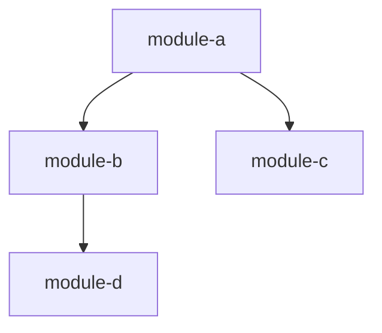

# Onboarding Document Template

Use this template structure when producing the final ONBOARDING.md. Adapt section depth and content to the actual codebase — omit sections that have no data, expand sections where the analysis is rich.

## Template

```markdown
# <Project Name> — Engineer Onboarding Guide

> Auto-generated codebase analysis. Language: <primary_language>. Modules: <count>. Relationships: <count>.

## Architecture Overview

<Narrative description of the system architecture. Start with the big picture: what does this system do, who uses it, and what are the major subsystems? Then describe the layering (e.g., API layer → service layer → data layer) and key architectural patterns (MVC, event-driven, microservices, monolith with modules, etc.).>

## Module Map

| Module | Purpose | Priority | Complexity |
|--------|---------|----------|------------|
| <name> | <2-3 word purpose> | read-first / read-second / skip | low / medium / high |

## Recommended Reading Order

Read modules in this order for the most efficient onboarding:

1. **<module>** — <rationale: why read this first>
2. **<module>** — <rationale: builds on previous>
...

## Relationship Map

### Tight Couplings

<For each tight coupling, describe: what modules, what type of coupling, what shared types or interfaces, and what breaks if misunderstood.>

### Loose Couplings

<Brief list of loose couplings — modules that interact but can be understood independently.>

### Dependency Graph

<If applicable, include a Mermaid diagram or reference dependency-graph.json:>



## Key Data Flows

Trace 2-3 real request/data paths through the system end-to-end.

### <Flow Name> (e.g., "User Authentication")

1. Request enters via `<module>` at `<entry point>`
2. Passed to `<module>` for `<processing>`
3. Data stored/retrieved via `<module>`
4. Response returned through `<module>`

## Implicit Contracts

Things you must know before touching the code — assumptions that are not explicit in type signatures or documentation:

- <contract description>
- <contract description>

## Top Gotchas

Non-obvious things that will trip up new engineers:

1. **<gotcha title>** — <description>
2. **<gotcha title>** — <description>
...
```

## Guidelines for the Synthesis Agent

- Write for a senior engineer who is new to THIS codebase, not new to programming
- Use concrete module names and function names, not abstract descriptions
- The Architecture Overview should be readable without the rest of the document
- Data flows should trace actual code paths, not hypothetical ones
- Gotchas should be specific and actionable, not generic advice
- If relationship data is not available (quick mode), omit the Relationship Map and Implicit Contracts sections rather than writing empty ones
