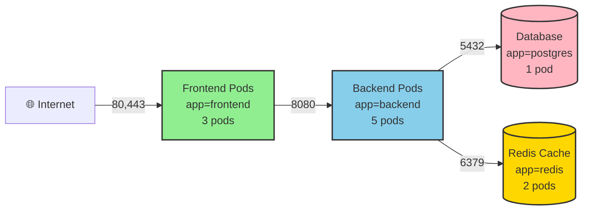
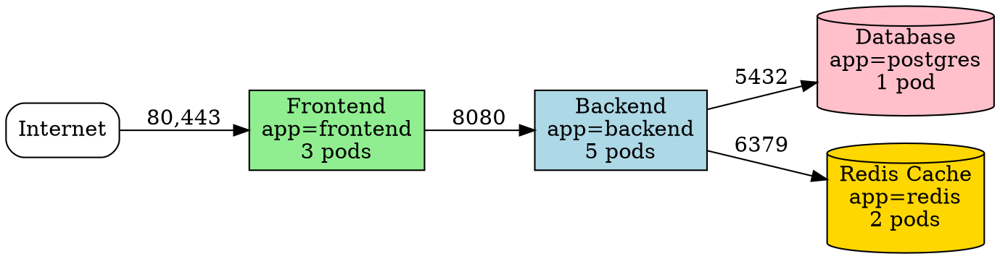

# NetworkPolicy Visualize Command

Generates visual network topology diagrams showing pod groups and allowed traffic flows based on NetworkPolicy rules.

## Usage

```bash
/network-policy-audit:visualize <namespace> [--format=FORMAT]
```

## Arguments

- `namespace` - Target namespace to visualize
- `--format` - Output format:
  - `mermaid` (default) - Mermaid diagram for GitHub/GitLab markdown
  - `dot` - Graphviz DOT format for rendering with dot/neato
  - `ascii` - Terminal-friendly ASCII art

## Implementation

The visualization process:

1. **Fetches all NetworkPolicies** in the namespace
2. **Groups pods by labels** to create logical components
3. **Extracts traffic flows** from ingress/egress rules
4. **Maps policies to flows** for policy attribution
5. **Generates diagram** in requested format

## Execution Steps

```bash
NAMESPACE="$1"
FORMAT="mermaid"

for arg in "$@"; do
    if [[ $arg == --format=* ]]; then
        FORMAT="${arg#*=}"
    fi
done

if [ -z "$NAMESPACE" ]; then
    echo "Error: namespace required"
    exit 1
fi

SCRIPT_DIR="$(cd "$(dirname "${BASH_SOURCE[0]}")/.." && pwd)/scripts"
python3 "${SCRIPT_DIR}/visualizer_cli.py" \
    --namespace="${NAMESPACE}" \
    --format="${FORMAT}"
```

## Example Outputs

### Mermaid Format



**Usage:**
- Copy-paste into GitHub markdown files
- Renders automatically in GitHub PRs/issues
- Great for architecture documentation

**Saved to:** `/tmp/netpol-viz-production.md`

### ASCII Format

```
                         PRODUCTION NAMESPACE NETWORK TOPOLOGY
                         
┌──────────┐
│ Internet │
└────┬─────┘
     │ 80,443 (allow-frontend-ingress)
     ↓
┌────────────────┐
│ Frontend Pods  │ app=frontend (3 pods)
│ ✓ Ingress: ✓  │
│ ✓ Egress:  ✓  │
└───────┬────────┘
        │ 8080 (allow-backend-access)
        ↓
   ┌────────────────┐
   │ Backend Pods   │ app=backend (5 pods)
   │ ✓ Ingress: ✓  │
   │ ✓ Egress:  ✓  │
   └───┬────────┬───┘
       │        │
       │ 5432   │ 6379
       ↓        ↓
  ┌─────────┐ ┌──────────┐
  │Database │ │  Redis   │
  │app=     │ │  Cache   │
  │postgres │ │app=redis │
  │✓ I: ✓   │ │✓ I: ✓    │
  └─────────┘ └──────────┘

LEGEND:
  → = Traffic flow allowed by NetworkPolicy
  ✓ I = Ingress policy applied
  ✓ E = Egress policy applied
  ✗   = Default-deny (no explicit allow)

POLICIES APPLIED (4):
  1. allow-frontend-ingress: Allows 80,443 from internet
  2. allow-backend-access: Frontend → Backend on 8080
  3. allow-db-access: Backend → Database on 5432
  4. allow-cache-access: Backend → Redis on 6379

DENIED TRAFFIC (not shown):
  - Database → * (default-deny egress)
  - Redis → * (default-deny egress)
  - Internet → Backend (no ingress policy)
```

### Graphviz DOT Format



**Render with:**
```bash
dot -Tpng /tmp/netpol-viz-production.dot -o network-topology.png
```

## Use Cases

### 1. Architecture Documentation

```bash
# Generate diagram for README.md
/network-policy-audit:visualize production --format=mermaid > docs/network-architecture.md
```

### 2. Security Review

```bash
# Visual inspection of traffic flows
/network-policy-audit:visualize production --format=ascii

# Quickly identify:
# - Public internet exposure
# - Unexpected cross-tier traffic
# - Missing segmentation
```

### 3. Onboarding New Engineers

```bash
# Show network design in terminal
/network-policy-audit:visualize my-app --format=ascii

# Helps understand:
# - Which services talk to which
# - Network security boundaries
# - Application architecture
```

## Visualization Features

### Pod Grouping Logic

Pods are grouped by common label prefixes:
- `app=frontend` → "Frontend Pods"
- `app=backend` → "Backend Pods"
- `app=postgres` → "Database"

### Color Coding (Mermaid/DOT)

- **Green**: Frontend/public-facing services
- **Blue**: Backend/API services
- **Pink**: Databases
- **Gold**: Caches/queues
- **Cloud shape**: External internet

### Traffic Flow Indicators

- **Solid arrows** (→): Traffic explicitly allowed by NetworkPolicy
- **Dashed arrows** (-.->): Traffic denied
- **Port labels**: Destination ports on arrows
- **Policy names**: Shown in subgraph or legend

## Error Handling

- **No NetworkPolicies found**: Generates "No policies (all traffic allowed)" diagram
- **Empty namespace**: Reports no pods to visualize
- **Invalid format**: Lists supported formats

## Integration Examples

### GitHub Actions

```yaml
- name: Generate Network Diagram
  run: |
    /network-policy-audit:visualize production --format=mermaid > network-topology.md
    
- name: Upload to PR
  uses: actions/github-script@v6
  with:
    script: |
      const fs = require('fs');
      const diagram = fs.readFileSync('network-topology.md', 'utf8');
      github.rest.issues.createComment({
        issue_number: context.issue.number,
        body: `## Network Topology\n\n${diagram}`
      });
```

## Related Commands

- `/network-policy-audit:analyze` - Text-based policy analysis
- `/network-policy-audit:test-connectivity` - Test specific connections
