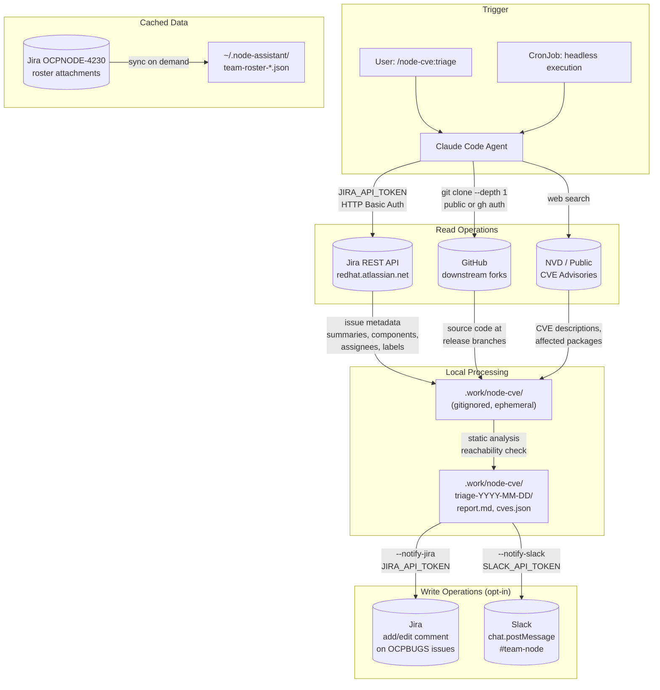

# Node Team AI Assistant - Data Flow Diagram

Control ID: DATA-02

## System Diagram

## Data Flow Summary

| Stage | Source | Destination | Data | Auth |
|-------|--------|-------------|------|------|
| 1. Query | Jira REST API | Agent memory | Issue keys, summaries, components, assignees, labels, status | `JIRA_API_TOKEN` (HTTP Basic) |
| 2. Clone | GitHub (public forks) | `.work/node-cve/repos/` | Source code at release branches (shallow clone) | None (public) or `gh auth` |
| 3. CVE intel | NVD, public advisories | Agent memory | CVE descriptions, affected packages, fixed versions | None (public) |
| 4. Analysis | Local source code | `.work/node-cve/triage-*/` | Reachability results, evidence, call paths | N/A (local) |
| 5a. Jira notify | `.work/` artifacts | Jira comment (OCPBUGS) | Analysis summary in wiki markup | `JIRA_API_TOKEN` |
| 5b. Slack notify | `.work/` artifacts | Slack message (#team-node) | Triage summary in Block Kit | `SLACK_API_TOKEN` or `SLACK_WEBHOOK` |
| Roster sync | Jira OCPNODE-4230 | `~/.node-assistant/` | Team member names, GitHub handles | `JIRA_API_TOKEN` |

## Secrets

| Secret | Purpose | Storage | Scope |
|--------|---------|---------|-------|
| `JIRA_API_TOKEN` | Jira read + comment | Env var, macOS Keychain, or Linux secret-tool | User's Jira permissions |
| `SLACK_API_TOKEN` | Slack message posting | Env var | Bot permissions in added channels |
| `SLACK_WEBHOOK` | Slack message posting (alternative) | Env var | Single channel webhook |
| GitHub auth | Repo cloning | `gh auth` | User's GitHub permissions |

In headless/CronJob mode, secrets are injected via OpenShift `secretRef`
(cve-triage-secrets). Tokens are never logged or printed to stdout.

## Local Persistence

| Location | Contents | Lifecycle |
|----------|----------|-----------|
| `.work/node-cve/repos/` | Shallow repo clones | Ephemeral; gitignored; can be large |
| `.work/node-cve/triage-YYYY-MM-DD/` | Reports, JSON, per-CVE analysis | Ephemeral; gitignored; one dir per run |
| `.work/node-bug/triage-YYYY-MM-DD/` | Bug triage reports | Ephemeral; gitignored; one dir per run |
| `.work/node-rpm/` | Dist-git clones, Vagrant VM | Ephemeral; gitignored; can be large |
| `~/.node-assistant/team-roster-*.json` | Cached team roster | Synced from Jira on demand |

Use `/node-team:cleanup` to purge old artifacts.
