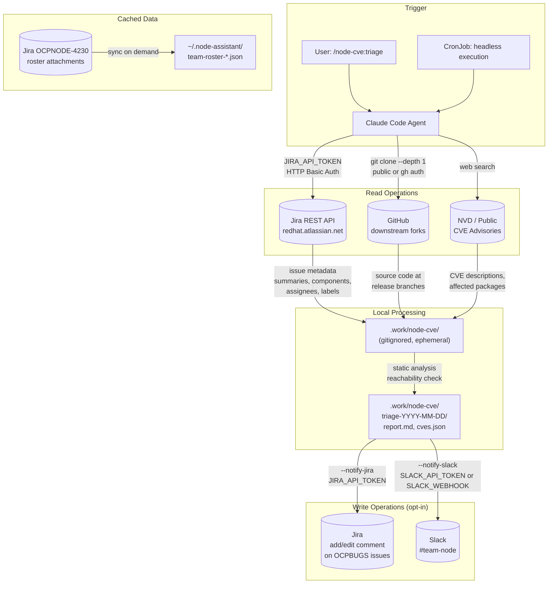

# Node Team AI Assistant - Data Flow Diagram

Control ID: DATA-02

## System Diagram

```mermaid
flowchart TD
    subgraph Trigger
        A1[User: /node-cve:triage] --> AGENT
        A2[CronJob: headless execution] --> AGENT
    end

    AGENT[Claude Code Agent]

    subgraph "Read Operations"
        AGENT -->|"JIRA_API_TOKEN<br/>HTTP Basic Auth"| JIRA_R[(Jira REST API<br/>redhat.atlassian.net)]
        AGENT -->|"git clone --depth 1<br/>public or gh auth"| GH[(GitHub<br/>downstream forks)]
        AGENT -->|"web search"| NVD[(NVD / Public<br/>CVE Advisories)]
    end

    subgraph "Local Processing"
        JIRA_R -->|"issue metadata<br/>summaries, components,<br/>assignees, labels"| LOCAL
        GH -->|"source code at<br/>release branches"| LOCAL[".work/node-cve/<br/>(gitignored, ephemeral)"]
        NVD -->|"CVE descriptions,<br/>affected packages"| LOCAL
        LOCAL -->|"static analysis<br/>reachability check"| REPORT[".work/node-cve/<br/>triage-YYYY-MM-DD/<br/>report.md, cves.json"]
    end

    subgraph "Write Operations (opt-in)"
        REPORT -->|"--notify-jira<br/>JIRA_API_TOKEN"| JIRA_W[(Jira<br/>add/edit comment<br/>on OCPBUGS issues)]
        REPORT -->|"--notify-slack<br/>SLACK_API_TOKEN or SLACK_WEBHOOK"| SLACK[(Slack<br/>#team-node)]
    end

    subgraph "Cached Data"
        ROSTER[(Jira OCPNODE-4230<br/>roster attachments)] -->|"sync on demand"| CACHE["~/.node-assistant/<br/>team-roster-*.json"]
    end
```

## Data Flow Summary

| Stage | Source | Destination | Data | Auth |
|-------|--------|-------------|------|------|
| 1. Query | Jira REST API | Agent memory | Issue keys, summaries, components, assignees, labels, status | `JIRA_API_TOKEN` (HTTP Basic) |
| 2. Clone | GitHub (public forks) | `.work/node-cve/repos/` | Source code at release branches (shallow clone) | None (public) or `gh auth` |
| 3. CVE intel | NVD, public advisories | Agent memory | CVE descriptions, affected packages, fixed versions | None (public) |
| 4. Analysis | Local source code | `.work/node-cve/triage-*/` | Reachability results, evidence, call paths | N/A (local) |
| 5a. Jira notify | `.work/` artifacts | Jira comment (OCPBUGS) | Analysis summary in wiki markup | `JIRA_API_TOKEN` |
| 5b. Slack notify | `.work/` artifacts | Slack message (#team-node) | Triage summary in Block Kit | `SLACK_API_TOKEN` or `SLACK_WEBHOOK` |
| Roster sync | Jira OCPNODE-4230 | `~/.node-assistant/` | Team member names, GitHub handles | `JIRA_API_TOKEN` |
| RPM bump (interactive only) | Upstream release tarball | Dist-git, Brew | Spec file, sources, build task | User's Kerberos ticket |

## Deployment Modes

| | Interactive | Headless |
|---|---|---|
| Runs on | Associate's CSB workstation | OpenShift CronJob `node-cve-triage` on a Red Hat-controlled cluster (cluster to be confirmed) |
| Triggered by | The user | Schedule, or a manual `oc create job` by a namespace admin |
| Plugins | All node plugins | `node-cve` and `node-team` only |
| Model access | Claude Code via Vertex AI, user's gcloud credentials | Claude Code via Vertex AI, service identity (Workload Identity Federation preferred, otherwise a rotated service account key) |
| Jira identity | User's API token | Service account (OCPBUGS browse, add comments and edit own comments; OCPNODE browse) |
| Slack | `SLACK_API_TOKEN` or `SLACK_WEBHOOK` | `SLACK_WEBHOOK` only |
| Tools | Approved per call by the user | Fixed allowlist in a mounted `settings.json`, see the [capabilities inventory](capabilities-inventory.md#headless-tool-allowlist) |
| Local storage | `.work/`, `~/.node-assistant/` | Pod ephemeral storage, discarded after each run |
| Audit trail | Local Claude Code transcripts and `posting-audit.log` | Session transcript (`--output-format stream-json`) on pod stdout and `posting-audit.log` on pod stderr, both kept by cluster logging |

## Secrets

| Secret | Purpose | Storage | Scope |
|--------|---------|---------|-------|
| `JIRA_API_TOKEN` | Jira read + comment | Interactive: env var, macOS Keychain, or Linux secret-tool. Headless: Kubernetes Secret | Interactive: user's Jira permissions. Headless: service account permissions |
| `SLACK_API_TOKEN` | Slack message posting | Env var (interactive only) | Bot permissions in added channels |
| `SLACK_WEBHOOK` | Slack message posting (alternative) | Env var or Kubernetes Secret | Single channel webhook |
| `JIRA_EMAIL` | Jira account for `curl` calls (comment lookup and edits) | Headless: Kubernetes Secret | Service account email |
| Vertex AI credentials | Model access | Interactive: gcloud user login. Headless: Workload Identity Federation config in a ConfigMap plus a projected, one-hour service account token; a service account key in a Secret, rotated at least quarterly, only if federation is not available | Vertex AI project only |
| `jira` CLI config | Server, login and auth type for the `jira` CLI | Headless: ConfigMap, referenced by `JIRA_CONFIG_FILE` | No credentials |
| GitHub auth | Repo cloning | `gh auth` (interactive only; headless clones public repos unauthenticated) | User's GitHub permissions |

In headless/CronJob mode, secrets are injected via OpenShift `secretRef`
(cve-triage-secrets). Node team members get read-only access to the
namespace without secrets; only the namespace admins can read secrets or
create Jobs (see the [user guide](user-guide.md#rbac-enforcement)). The skills
never print tokens. The session transcript in the pod logs contains tool
inputs and outputs, including Jira issue data, so access to the logs must be
limited to the same audience as the Jira data.

Atlassian Cloud service accounts may require scoped API tokens that go
through the `api.atlassian.com/ex/jira/<cloudId>` gateway instead of the site
URL. That would change both the `jira` CLI server setting and the base URL of
the `curl` calls. Verify both against the actual service account before the
first headless run.

## Prompt Injection

The agent reads untrusted text: Jira issue descriptions and comments, NVD and
vendor advisory pages, and the source code of cloned repositories. Any of it
can contain instructions aimed at the model. In headless mode no human
reviews the tool calls before they run, and the pod holds a Jira token, a
Slack webhook and Vertex AI credentials.

Mitigations, in order of strength:

1. **Egress policy (required):** the pod can only reach Jira, Slack, GitHub,
   the public advisory sites and Vertex AI, so injected instructions cannot
   send data to an attacker-controlled host.
2. **Least-privilege credentials:** a leaked Jira token can only browse and
   comment, the webhook only posts to #team-node.
3. **Tool allowlist:** limits what the agent does by default, but is not a
   boundary (see the
   [capabilities inventory](capabilities-inventory.md#security-boundary)).
4. **Posting safeguards:** component and version re-validation before every
   Jira comment, and the audit log and transcript for review.

## Local Persistence

| Location | Contents | Lifecycle |
|----------|----------|-----------|
| `.work/node-cve/repos/` | Shallow repo clones | Ephemeral; gitignored; can be large |
| `.work/node-cve/triage-YYYY-MM-DD/` | Reports, JSON, per-CVE analysis | Ephemeral; gitignored; one dir per run |
| `.work/node-bug/triage-YYYY-MM-DD/` | Bug triage reports | Ephemeral; gitignored; one dir per run |
| `.work/node-rpm/` | Dist-git clones, Vagrant VM | Ephemeral; gitignored; can be large |
| `~/.node-assistant/team-roster-*.json` | Cached team roster | Synced from Jira on demand |

Use `/node-team:cleanup` to purge old artifacts.
