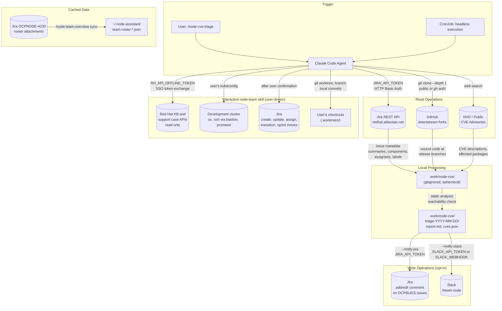

# Node Team AI Assistant - Data Flow Diagram

Control ID: DATA-02

## System Diagram

```mermaid
flowchart TD
    subgraph Trigger
        A1[User: /node-cve:triage] --> AGENT
        A2[CronJob: headless execution] --> AGENT
    end

    AGENT[Claude Code Agent]

    subgraph "Read Operations"
        AGENT -->|"JIRA_API_TOKEN<br/>HTTP Basic Auth"| JIRA_R[(Jira REST API<br/>redhat.atlassian.net)]
        AGENT -->|"git clone --depth 1<br/>public or gh auth"| GH[(GitHub<br/>downstream forks)]
        AGENT -->|"web search"| NVD[(NVD / Public<br/>CVE Advisories)]
    end

    subgraph "Local Processing"
        JIRA_R -->|"issue metadata<br/>summaries, components,<br/>assignees, labels"| LOCAL
        GH -->|"source code at<br/>release branches"| LOCAL[".work/node-cve/<br/>(gitignored, ephemeral)"]
        NVD -->|"CVE descriptions,<br/>affected packages"| LOCAL
        LOCAL -->|"static analysis<br/>reachability check"| REPORT[".work/node-cve/<br/>triage-YYYY-MM-DD/<br/>report.md, cves.json"]
    end

    subgraph "Write Operations (opt-in)"
        REPORT -->|"--notify-jira<br/>JIRA_API_TOKEN"| JIRA_W[(Jira<br/>add/edit comment<br/>on OCPBUGS issues)]
        REPORT -->|"--notify-slack<br/>SLACK_API_TOKEN or SLACK_WEBHOOK"| SLACK[(Slack<br/>#team-node)]
    end

    subgraph "Cached Data"
        ROSTER[(Jira OCPNODE-4230<br/>roster attachments)] -->|"/node-team:overview sync"| CACHE["~/.node-assistant/<br/>team-roster-*.json"]
    end

    subgraph "Interactive node-team skill (user-driven)"
        AGENT -->|"RH_API_OFFLINE_TOKEN<br/>SSO token exchange"| RHAPI[(Red Hat KB and<br/>support case APIs<br/>read only)]
        AGENT -->|"user's kubeconfig"| CLUSTER[(Development cluster<br/>oc, ssh via bastion, promtool)]
        AGENT -->|"after user confirmation"| JIRA_I[(Jira<br/>create, update, assign,<br/>transition, sprint moves)]
        AGENT -->|"git worktree, branch,<br/>local commits"| WT["User's checkouts<br/>(.worktrees/)"]
    end
```

The upper part of the diagram is the automated `node-cve` flow. The last
subgraph is the interactive `node-team:node` skill, where every step is
requested and approved by the user in the session.

## Data Flow Summary

| Stage | Source | Destination | Data | Auth |
|-------|--------|-------------|------|------|
| 1. Query | Jira REST API | Agent memory | Issue keys, summaries, components, assignees, labels, status | `JIRA_API_TOKEN` (HTTP Basic) |
| 2. Clone | GitHub (public forks) | `.work/node-cve/repos/` | Source code at release branches (shallow clone) | None (public) or `gh auth` |
| 3. CVE intel | NVD, public advisories | Agent memory | CVE descriptions, affected packages, fixed versions | None (public) |
| 4. Analysis | Local source code | `.work/node-cve/triage-*/` | Reachability results, evidence, call paths | N/A (local) |
| 5a. Jira notify | `.work/` artifacts | Jira comment (OCPBUGS) | Analysis summary as wiki markup through the REST API v2 comment endpoints (node-cve specific exception; all other Jira workflows use v3 with ADF bodies, see `jira.md`) | `JIRA_API_TOKEN` |
| 5b. Slack notify | `.work/` artifacts | Slack message (#team-node) | Triage summary in Block Kit | `SLACK_API_TOKEN` or `SLACK_WEBHOOK` |
| Roster sync (`/node-team:overview`) | Jira OCPNODE-4230 | `~/.node-assistant/team-roster-*.json` | Team member display names, GitHub handles (no email addresses) | `JIRA_API_TOKEN` |
| KB / case lookup (interactive) | Red Hat KB and support case APIs | Agent memory only | KB solutions; case metadata and comments (customer data, not written to disk) | `RH_API_OFFLINE_TOKEN` exchanged for an access token |
| Jira write (interactive) | User request | Jira issue | Fields, comments, transitions the user asked for and confirmed | `JIRA_API_TOKEN` |
| Dev setup (interactive) | GitHub | User's checkout, `.worktrees/` | Full clone, branches, worktrees, local commits | None (public) or `gh auth` |
| Cluster debug (interactive) | Development cluster | Agent memory, cluster | Node state, metrics, debug binaries | User's kubeconfig, install-time SSH key |
| RPM bump (interactive only) | Upstream release tarball | Dist-git, Brew | Spec file, sources, build task (each upload, push and build confirmed by the user) | User's Kerberos ticket |

## Deployment Modes

| | Interactive | Headless (CronJob) | Headless (Chai RWS) |
|---|---|---|---|
| Runs on | Associate's CSB workstation | OpenShift CronJob `node-cve-triage` on a Red Hat-controlled cluster (cluster to be confirmed) | Chai RWS worker pod started by a Chai scheduled task (`general_dev` environment) |
| Triggered by | The user | Schedule, or a manual `oc create job` by a namespace admin | Chai schedule, or a manual trigger in Chai |
| Plugins | All node plugins | `node-cve` and `node-team` only | `node-cve` and `node-team` only, registered at a pinned openshift-eng/ai-helpers ref |
| Model access | Claude Code via Vertex AI, user's gcloud credentials | Claude Code via Vertex AI, service identity (Workload Identity Federation preferred, otherwise a rotated service account key) | Provided by Chai |
| Jira identity | User's API token, account from `JIRA_USER` / `JIRA_EMAIL` | Service account (OCPBUGS browse, add comments and edit own comments; OCPNODE browse), account from `JIRA_EMAIL` | Node team Atlassian Cloud account bound in Chai Bot Home (OCPBUGS browse and add comments; OCPNODE browse). Only the coordinator uses it; the worker gets no credentials |
| Slack | `SLACK_API_TOKEN` or `SLACK_WEBHOOK` | `SLACK_WEBHOOK` only | Chai coordinator report, no webhook |
| Tools | Approved per call by the user | Fixed allowlist in a mounted `settings.json`, see the [capabilities inventory](capabilities-inventory.md#headless-tool-allowlist) | Worker: Chai RWS sandbox, git through the manager proxy, no Jira or Slack access. Coordinator: Chai Jira tools (`query_jira`, `get_jira_issue`, `comment_on_jira_issue`) |
| Local storage | `.work/`, `~/.node-assistant/` | Pod ephemeral storage, discarded after each run | Worker pod storage, discarded after each run |
| Posting | Asks for confirmation before any Jira or Slack post, `--dry-run` available | `--yes` passed deliberately in the CronJob; the `--max-trackers` threshold still aborts Jira posting | `--handoff`: the worker validates and writes `posting-plan.json`, the coordinator re-checks each tracker live and posts; `--max-trackers` still empties the plan |
| Audit trail | Local Claude Code transcripts and `posting-audit.log` | Session transcript (`--output-format stream-json`) on pod stdout and the audit events from `posting-history.log` on pod stderr, both kept by cluster logging | Chai OTEL tracing, worker output with `posting-audit.log` and the plan, coordinator tool calls |

## Secrets

| Secret | Purpose | Storage | Scope |
|--------|---------|---------|-------|
| `JIRA_API_TOKEN` | Jira read; comments (node-cve); interactive writes after confirmation (node-team) | Interactive: env var, macOS Keychain, or Linux secret-tool. Headless: Kubernetes Secret | Interactive: user's Jira permissions. Headless: service account permissions |
| `JIRA_USER` / `JIRA_EMAIL` | Jira account email for Basic Auth (not a secret) | Interactive: env var, Keychain account, or `git config user.email`. Headless: `JIRA_EMAIL` in the Kubernetes Secret | Headless: service account email |
| `RH_API_OFFLINE_TOKEN` | Red Hat KB and support case lookups (read) | macOS Keychain or Linux secret-tool (interactive only) | User's customer portal permissions |
| Kubeconfig / SSH key | Development cluster access | User's local files (interactive only) | User's cluster RBAC |
| `SLACK_API_TOKEN` | Slack message posting | Env var (interactive only) | Bot permissions in added channels |
| `SLACK_WEBHOOK` | Slack message posting (alternative) | Env var or Kubernetes Secret | Single channel webhook |
| Vertex AI credentials | Model access | Interactive: gcloud user login. Headless: Workload Identity Federation config in a ConfigMap plus a projected, one-hour service account token; a service account key in a Secret, rotated at least quarterly, only if federation is not available | Vertex AI project only |
| GitHub auth | Repo cloning | `gh auth` (interactive only; headless clones public repos unauthenticated) | User's GitHub permissions |

In headless/CronJob mode, secrets are injected via OpenShift `secretRef`
(cve-triage-secrets). Node team members get read-only access to the
namespace without secrets; only the namespace admins can read secrets or
create Jobs (see the [user guide](user-guide.md#rbac-enforcement)). Tokens are
never logged, printed to stdout, or written to files. They are also kept off
command lines: curl reads credentials from stdin (`curl -K -`), so they do not
appear in the process list or in the session transcript. Presence checks use
`[ -n "$VAR" ]`, never `echo`. The session transcript in the pod logs contains tool
inputs and outputs, including Jira issue data, so access to the logs must be
limited to the same audience as the Jira data.

Atlassian Cloud service accounts may require scoped API tokens that go
through the `api.atlassian.com/ex/jira/<cloudId>` gateway instead of the site
URL. That would change the base URL of the Jira REST calls, which the node-cve
helper script takes from `JIRA_BASE`. Verify it against the actual service
account before the first headless run.

## Prompt Injection

The agent reads untrusted text: Jira issue descriptions and comments, NVD and
vendor advisory pages, and the source code of cloned repositories. Any of it
can contain instructions aimed at the model. In headless mode no human
reviews the tool calls before they run, and the pod holds a Jira token, a
Slack webhook and Vertex AI credentials.

Mitigations, in order of strength:

1. **Egress policy (required):** the pod can only reach Jira, Slack, GitHub,
   the public advisory sites and Vertex AI, so injected instructions cannot
   send data to an attacker-controlled host.
2. **Least-privilege credentials:** a leaked Jira token can only browse and
   comment, the webhook only posts to #team-node.
3. **Tool allowlist:** limits what the agent does by default, but is not a
   boundary (see the
   [capabilities inventory](capabilities-inventory.md#security-boundary)).
4. **Posting safeguards, enforced by the helper script and not by the
   prompt:** component and version re-validation before every Jira comment,
   the `--max-trackers` abort threshold, no post without a working
   deduplication lookup, edits only to the account's own comments, and the
   audit log and transcript for review.

## Local Persistence

| Location | Contents | Lifecycle |
|----------|----------|-----------|
| `.work/node-cve/repos/` | Shallow repo clones | Ephemeral; gitignored; can be large |
| `.work/node-cve/triage-YYYY-MM-DD/` | Reports, JSON, per-CVE analysis | Ephemeral; gitignored; one dir per run |
| `.work/node-cve/trackers*.tsv`, `node-components.txt`, `current-run`, `reanalyze-consumed.txt` | Tracker query results (issue summaries, assignee display names), component list, run pointer, honored `[reanalyze]` tags (issue key and comment id) | Overwritten by each run; gitignored; removed by `/node-team:cleanup` |
| `.work/node-bug/triage-YYYY-MM-DD/` | Bug triage reports | Ephemeral; gitignored; one dir per run |
| `.work/node-rpm/` | Dist-git clones, Vagrant VM | Ephemeral; gitignored; can be large |
| `.work/node-cve/triage-YYYY-MM-DD/posting-audit.log` | Record of the run's Jira and Slack posts | Purged with the triage directory |
| `.work/node-cve/posting-history.log` | Append-only record of all Jira and Slack posts | Kept by cleanup unless confirmed separately |
| `~/.node-assistant/team-roster-*.json` | Cached team roster | Synced from Jira by `/node-team:overview` |
| `~/.node-assistant/onboarding-progress.json` | Onboarding checklist progress (user state, not a cache) | Written by `/node-onboarding:checklist`; kept by cleanup unless confirmed separately |
| `.worktrees/` inside user checkouts | Development worktrees | Managed by the user; never touched by cleanup |

Use `/node-team:cleanup` to purge old artifacts.
