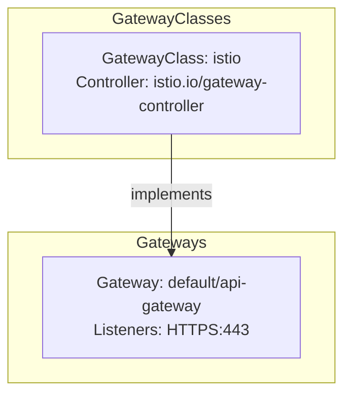

# Gateway API Topology Visualization

Generate and visualize Kubernetes Gateway API topology diagrams showing the complete resource hierarchy.

## Overview

The `/openshift:visualize-gateway-topology` command automatically discovers your Gateway API resources and generates a comprehensive Mermaid diagram showing:

- **GatewayClasses** with their controllers and status
- **Gateways** with listeners, addresses, and status
- **Routes** (HTTPRoute, GRPCRoute, TCPRoute, TLSRoute) with hostnames and rules
- **Backend Services** referenced by routes
- **ReferenceGrants** for cross-namespace access
- **Relationships** between all resources

The command is **read-only** and performs no cluster modifications.

## Quick Start

### Prerequisites

- **kubectl**: Installed and configured with access to a Kubernetes cluster
- **Gateway API**: CRDs installed in your cluster
- **Optional**: gwctl for enhanced data collection

### Installing Gateway API CRDs

If Gateway API is not installed in your cluster:

```bash
kubectl apply -f https://github.com/kubernetes-sigs/gateway-api/releases/download/v1.0.0/standard-install.yaml
```

### Basic Usage

Simply run the command - it will automatically detect your cluster:

```shell
/openshift:visualize-gateway-topology
```

The command will:
1. Detect clusters with Gateway API CRDs installed
2. Check your permissions and warn if you have admin access
3. Collect all Gateway API resources
4. Analyze topology relationships
5. Generate a Mermaid diagram
6. Save to `gateway-topology-diagram.md`

### Example Output

```text
✅ Successfully generated Gateway API topology diagram

📄 Diagram saved to: gateway-topology-diagram.md

Summary:
- 2 GatewayClasses (istio, nginx)
- 3 Gateways
- 8 HTTPRoutes, 2 GRPCRoutes
- 12 Backend Services
- 1 ReferenceGrant

💡 Open the file in your IDE to view the full rendered Mermaid diagram!
```

## What Gets Visualized

### Resource Hierarchy (Top-to-Bottom)

The diagram shows the complete Gateway API resource hierarchy:

1. **GatewayClass Layer** - Cluster-scoped gateway implementations
   - Controller name and status
   - One per gateway type (istio, nginx, etc.)

2. **Gateway Layer** - Load balancer/proxy instances
   - Namespace and name
   - Listeners (protocol:port)
   - Addresses (IP or hostname)

3. **Route Layer** - Routing rules
   - HTTPRoute, GRPCRoute, TCPRoute, TLSRoute
   - Hostnames and paths
   - Parent gateway references

4. **Backend Layer** - Target services
   - Kubernetes Services
   - Ports and types

### Relationship Types

The diagram shows connections between resources:

- **implements**: GatewayClass → Gateway
- **attaches**: Gateway → Route
- **references**: Route → Service
- **grants** (cross-namespace): ReferenceGrant → allowed references

## Security & Safety

### Read-Only Operations

This command performs **ONLY read-only operations**:

✅ **What it does:**
- `kubectl get` - Query Gateway API resources
- `gwctl get/describe` - Query resources (if gwctl available)
- Local file writes - Save topology diagram

❌ **What it NEVER does:**
- `kubectl create/delete/patch/apply` - No resource modifications
- `gwctl apply/delete` - No resource modifications
- No Gateway or Route changes
- No service disruptions

### Permission Checking

If you have cluster admin permissions, the command will:
1. Detect write permissions before starting
2. Display exactly what permissions you have
3. Explain that only read-only operations will be performed
4. Ask for your explicit consent to proceed

## Output Format

### Generated Diagram

The command creates a Mermaid diagram in Markdown format:

```markdown
# Gateway API Topology

## Summary
- GatewayClasses: 2
- Gateways: 3
- Routes: 10
- Backends: 12

## Topology Diagram


```

### Viewing the Diagram

**In VS Code / Claude Code:**
- Open `gateway-topology-diagram.md`
- Diagram renders automatically in preview pane

**In GitHub:**
- Diagrams render automatically in markdown preview

**Export to Image:**
- Use Mermaid CLI or online editors to export PNG/SVG

## Using gwctl

The command can use [gwctl](https://github.com/kubernetes-sigs/gwctl) for enhanced data collection if available.

### Installing gwctl

**macOS/Linux (Homebrew):**
```bash
brew install gwctl
```

**From Source:**
```bash
git clone https://github.com/kubernetes-sigs/gwctl
cd gwctl
make build
```

### Benefits of gwctl

- Richer resource details
- Better relationship detection
- Native Gateway API tooling

The command automatically detects if gwctl is available and uses it when possible, falling back to kubectl otherwise.

## Troubleshooting

### "No clusters with Gateway API found"

**Cause**: No kubeconfig with Gateway API CRDs detected

**Solutions**:
1. Install Gateway API CRDs:
   ```bash
   kubectl apply -f https://github.com/kubernetes-sigs/gateway-api/releases/download/v1.0.0/standard-install.yaml
   ```
2. Verify CRDs are installed:
   ```bash
   kubectl get crd gateways.gateway.networking.k8s.io
   ```
3. Set kubeconfig explicitly:
   ```bash
   export KUBECONFIG=/path/to/config
   ```

### "Permission denied" or "Forbidden"

**Cause**: Insufficient RBAC permissions

**Solutions**:
1. Verify you can list gateways:
   ```bash
   kubectl get gateways -A
   ```
2. Contact cluster admin to grant read access to Gateway API resources

Required permissions:
- `get`, `list` on gateways, httproutes, gatewayclasses, services
- No write permissions needed

### "File already exists"

**Cause**: `gateway-topology-diagram.md` already exists in current directory

**Solutions**:
The command will prompt you to:
1. Overwrite existing file
2. Save to a different location
3. Append timestamp to filename
4. Cancel operation

### Diagram appears empty

**Cause**: No Gateway API resources deployed

**Solutions**:
1. Verify resources exist:
   ```bash
   kubectl get gateways,httproutes -A
   ```
2. Deploy sample Gateway API resources for testing
3. Check that GatewayClass controller is installed and running

## FAQ

**Q: Does this modify my cluster?**
A: No. The command only reads cluster state - no modifications are made.

**Q: Will this work without Gateway API installed?**
A: No. The command requires Gateway API CRDs to be installed.

**Q: Can I run this on a production cluster?**
A: Yes. All operations are read-only and lightweight. Verify commands if you have write access.

**Q: What Gateway controllers are supported?**
A: All controllers implementing the Gateway API spec (Istio, Nginx, Envoy, Kong, Traefik, etc.)

**Q: Does this show Ingress resources?**
A: No. This focuses on Gateway API resources, not the legacy Ingress API.

**Q: Can I customize the diagram appearance?**
A: Yes. Edit the generated `.md` file - modify Mermaid syntax for colors, layout, etc.

**Q: How do cross-namespace routes work?**
A: Cross-namespace references require ReferenceGrants. The diagram shows these relationships.

## Files Created

The command creates these temporary files during execution (automatically cleaned up):

```text
$TMPDIR/gateway_classes_detail.txt    # GatewayClass data
$TMPDIR/gateways_detail.txt           # Gateway data
$TMPDIR/httproutes_detail.txt         # HTTPRoute data
$TMPDIR/grpcroutes_detail.txt         # GRPCRoute data
$TMPDIR/tcproutes_detail.txt          # TCPRoute data
$TMPDIR/tlsroutes_detail.txt          # TLSRoute data
$TMPDIR/backends_detail.txt           # Backend service data
$TMPDIR/reference_grants_detail.txt   # ReferenceGrant data
$TMPDIR/gateway_relationships.txt     # Topology relationships
```

All temporary files are removed after diagram generation completes.

## Technical Details

For AI agents and developers, see:
- **Implementation details**: [SKILL.md](SKILL.md)
- **Helper scripts**: [scripts/](scripts/)

## Support

For issues or questions:
- **Repository**: <https://github.com/openshift-eng/ai-helpers>
- **Issues**: <https://github.com/openshift-eng/ai-helpers/issues>

## License

See repository [LICENSE](../../../../LICENSE) file.
