# Quick Start - Gateway API Topology Generation

**IMMEDIATE ACTIONS** (follow these steps in order):

1. **Detect Cluster**: Find a cluster with Gateway API CRDs installed

   Run: `scripts/detect-gateway-cluster.sh 2>/dev/null`

   The script discovers clusters with Gateway API:
   - Scans all kubeconfig files: current KUBECONFIG env, ~/.kube/kind-config, ~/.kube/config
   - Tests ALL contexts in each kubeconfig
   - Returns parseable list to stdout: `index|kubeconfig|cluster_name|gateway_count|installed_crds`
   - Diagnostics go to stderr
   - Exit code: 0=success, 1=no clusters found

   **How to handle the output:**

   The script returns pipe-delimited lines to stdout, one per cluster found, e.g.:
   ```text
   1|/home/user/.kube/config|prod-cluster|5|gateways,httproutes,gatewayclasses
   2|/home/user/.kube/kind-config|dev-cluster|2|gateways,httproutes
   ```

   **Decision logic:**
   - If **one cluster** found → automatically use it (extract kubeconfig path from column 2)
   - If **multiple clusters** found → show the list to user and ask them to choose by number
   - After selection, extract the kubeconfig path from column 2 of the chosen line
   - Store the selected kubeconfig path in variable `KC` for use in subsequent steps

   **Example output format parsing:**
   - Column 1: Index number (for user selection)
   - Column 2: Kubeconfig file path (this is what you need for `$KC`)
   - Column 3: Cluster display name
   - Column 4: Number of Gateway resources
   - Column 5: Installed Gateway API CRDs

2. **Check Permissions**: Verify user's Kubernetes access level and inform about write permissions

   Run: `scripts/check_permissions.py "$KC"`

   The script returns:
   - **Exit 0**: Read-only access or user confirmed → proceed
   - **Exit 1**: Error or user cancelled → stop
   - **Exit 2**: Write permissions detected → AI must ask user for confirmation

   **When exit code 2 is returned:**
   1. Parse the stdout to get the list of write permissions
   2. Display the permissions clearly to the user using a formatted message
   3. Explain that:
      - This skill performs ONLY read-only operations
      - No cluster modifications will be made
      - The warning is for transparency about their access level
      - List read-only operations: kubectl get (gateways, httproutes, services, etc.)
      - List forbidden operations: kubectl create/delete/patch, no Gateway modifications
   4. **Ask the user explicitly**: "You have cluster admin permissions. This command will only perform read-only operations. Do you want to proceed?"
   5. If user says yes → continue, if no → stop

3. **Check Output File**: Ask user if `gateway-topology-diagram.md` exists:
   - (1) Overwrite, (2) Custom path, (3) Timestamp, (4) Cancel

4. **Create Private Temp Directory**: Create a private temporary directory using `mkdtemp` and use it for all temporary files.

   ```bash
   TMPDIR=$(mktemp -d)
   ```

5. **Collect Gateway Data**: Get all Gateway API resources from the cluster

   Run: `scripts/collect_gateway_data.py "$KC" "$TMPDIR"`

   Detail files written to `$TMPDIR`:
   - `gateway_classes_detail.txt` - name|controller|description|status
   - `gateways_detail.txt` - namespace|name|class|listeners|addresses|status
   - `httproutes_detail.txt` - namespace|name|hostnames|parent_refs|backend_refs
   - `grpcroutes_detail.txt` - namespace|name|parent_refs|backend_refs
   - `tcproutes_detail.txt` - namespace|name|parent_refs|backend_refs
   - `tlsroutes_detail.txt` - namespace|name|hostnames|parent_refs|backend_refs
   - `backends_detail.txt` - namespace|name|type|ports|pod_count
   - `reference_grants_detail.txt` - namespace|name|from_refs|to_refs
   - `route_rules_detail.txt` - route_ns|route_name|rule_idx|match_condition|backends_with_weights
   - `endpoints_detail.txt` - svc_namespace|svc_name|pod_name|pod_ip|ready

6. **Analyze Topology**: Build relationship graph from collected data

   Run: `scripts/analyze_topology.py "$TMPDIR"`

   Relationships written to `$TMPDIR`:
   - `gateway_relationships.txt` - source_type|source_id|relation|target_type|target_id

7. **Generate Diagram**: Create Mermaid `graph TB` diagram
   - Read `$TMPDIR/gateway_relationships.txt` to determine connections
   - Read detail files directly for resource attributes
   - Group resources by type in subgraphs

8. **Save & Report**: Write diagram to file, show summary, clean up temporary files

**CRITICAL RULES**:
- ❌ NO codebase searching for IPs/ports
- ❌ NO synthetic/example data
- ❌ NO inline multi-line bash (use helper scripts)
- ❌ NO direct kubectl commands (must use helper scripts only)
- ✅ Use helper scripts for all kubectl interactions
- ✅ **SECURITY**: Create private temp directory with `TMPDIR=$(mktemp -d)` - never use `/tmp` directly
- ✅ Temporary files use `$TMPDIR` (private directory created with mkdtemp)
- ✅ Clean up temporary files when done: `rm -rf "$TMPDIR"`

## Safety & Security Guarantees

### Read-Only Operations

This skill performs **ONLY read-only operations** against your Kubernetes cluster. No cluster state is modified.

**Allowed Operations:**
- ✅ `kubectl get` - Query Gateway API resources
- ✅ `gwctl get/describe` - Query resources if gwctl is available
- ✅ Local file writes (temporary files in `$TMPDIR`, output diagram)

**Forbidden Operations (NEVER used):**
- ❌ `kubectl create/apply/delete/patch` - No resource modifications
- ❌ `gwctl apply/delete` - No resource modifications
- ❌ No Gateway/Route creation or deletion
- ❌ No service disruptions

**Privacy Consideration**: The generated diagram contains Gateway API topology information including hostnames and backend services. Control sharing appropriately based on your security policies.

---

# Gateway API Concepts

## Resource Hierarchy

The Gateway API follows a hierarchical model:

1. **GatewayClass** (cluster-scoped)
   - Defines a type of Gateway managed by a controller
   - Examples: istio, nginx, envoy, kong

2. **Gateway** (namespace-scoped)
   - Represents an actual load balancer or proxy
   - Has listeners (ports, protocols, hostnames)
   - References a GatewayClass

3. **Routes** (namespace-scoped)
   - HTTPRoute, GRPCRoute, TCPRoute, TLSRoute
   - Define routing rules from Gateway to backends
   - Reference parent Gateways

4. **Backend Services** (namespace-scoped)
   - Kubernetes Services referenced by Routes
   - May include port and weight configurations

5. **ReferenceGrants** (namespace-scoped)
   - Allow cross-namespace references
   - Required when Route in namespace A references Service in namespace B

## Helper Scripts

All helper scripts are in the `scripts/` directory.

| Script | Purpose | Input | Output |
|--------|---------|-------|--------|
| [detect-gateway-cluster.sh](scripts/detect-gateway-cluster.sh) | Find cluster with Gateway API CRDs across all contexts | None | Parseable list to stdout: `index\|kubeconfig\|cluster\|gateways\|crds`. Exit: 0=success, 1=none found |
| [check_permissions.py](scripts/check_permissions.py) | Check user permissions and warn if write access detected | KUBECONFIG path | Exit: 0=proceed, 1=cancelled/error, 2=write perms (needs user confirmation) |
| [collect_gateway_data.py](scripts/collect_gateway_data.py) | Collect all Gateway API resources from cluster | KUBECONFIG path, TMPDIR | Detail files: `gateway_classes_detail.txt`, `gateways_detail.txt`, `httproutes_detail.txt`, etc. |
| [analyze_topology.py](scripts/analyze_topology.py) | Build relationship graph from collected data | TMPDIR (reads detail files) | Relationships file: `gateway_relationships.txt` |

---

# Diagram Generation Rules

## Structure Options

There are two diagram modes based on complexity:

### Mode 1: Per-Gateway Subgraphs (Detailed - for clusters with 1-3 Gateways)

Use this mode for detailed visualization showing listeners, rules, and endpoints within each Gateway.


### Mode 2: Layered Overview (Simple - for clusters with 4+ Gateways)

Use this mode for high-level overview when there are many Gateways.

```mermaid
graph TB
    %% Title
    subgraph title["Gateway API Topology"]
        direction TB

        %% Layer 1: GatewayClasses (cluster-scoped)
        subgraph gc_layer["GatewayClasses"]
            GC_istio["GatewayClass: istio<br/>Controller: istio.io/gateway-controller<br/>Status: Accepted"]
        end

        %% Layer 2: Gateways
        subgraph gw_layer["Gateways"]
            GW_api["Gateway: default/api-gateway<br/>Listeners: HTTPS:443, HTTP:80<br/>Address: 10.0.0.50"]
        end

        %% Layer 3: Routes
        subgraph route_layer["Routes"]
            HR_api["HTTPRoute: default/api-routes<br/>Hostnames: api.example.com"]
            HR_web["HTTPRoute: default/web-routes<br/>Hostnames: www.example.com"]
        end

        %% Layer 4: Backend Services
        subgraph backend_layer["Backend Services"]
            SVC_api["Service: default/api-svc<br/>Type: ClusterIP<br/>Ports: 8080→8080/TCP"]
            SVC_web["Service: default/web-svc<br/>Type: ClusterIP<br/>Ports: 80→80/TCP"]
        end

        %% Connections
        GC_istio -->|implements| GW_api
        GW_api -->|attaches| HR_api
        GW_api -->|attaches| HR_web
        HR_api -->|references| SVC_api
        HR_web -->|references| SVC_web
    end

    %% Styles
    classDef gatewayclass fill:#e8f5e9,stroke:#2e7d32,stroke-width:2px,color:#000
    classDef gateway fill:#e3f2fd,stroke:#1565c0,stroke-width:2px,color:#000
    classDef route fill:#fff3e0,stroke:#e65100,stroke-width:2px,color:#000
    classDef service fill:#f3e5f5,stroke:#6a1b9a,stroke-width:2px,color:#000

    class GC_istio gatewayclass
    class GW_api gateway
    class HR_api,HR_web route
    class SVC_api,SVC_web service
```



## Key Requirements

1. **Graph Direction**: Always `graph TB` (top-to-bottom)

2. **Mode Selection**:
   - **Per-Gateway Subgraphs** (Mode 1): Use when 1-3 Gateways exist - shows detailed listeners, rules, weights, and endpoints
   - **Layered Overview** (Mode 2): Use when 4+ Gateways exist - shows high-level relationships only

3. **Resource Layers** (top to bottom):
   - Layer 1: GatewayClasses (cluster-scoped, at top)
   - Layer 2: Gateways (with Listeners sub-layer in Mode 1)
   - Layer 3: Routes (HTTPRoute, GRPCRoute, TCPRoute, TLSRoute)
   - Layer 4: Route Rules (Mode 1 only - with path/header matches)
   - Layer 5: Backend Services (with weights in Mode 1)
   - Layer 6: Pod Endpoints (Mode 1 only - with IPs and ready status)

4. **Node Identifiers**: Use unique IDs based on resource type and name:
   - GatewayClass: `GC_{name}` (e.g., `GC_istio`)
   - Gateway: `GW_{namespace}_{name}` (e.g., `GW_default_api_gateway`)
   - Listener: `L{gw_idx}_{protocol}` (e.g., `L1_https`)
   - HTTPRoute: `HR_{namespace}_{name}` or `HR{gw_idx}_{name}` in Mode 1
   - GRPCRoute: `GR_{namespace}_{name}`
   - TCPRoute: `TR_{namespace}_{name}`
   - TLSRoute: `TL_{namespace}_{name}`
   - RouteRule: `R{gw_idx}_{rule_idx}` (e.g., `R1_0`)
   - Service: `SVC_{namespace}_{name}` or `SVC{gw_idx}_{name}` in Mode 1
   - Pod: `POD{gw_idx}_{idx}` (e.g., `POD1_1`)

5. **Node Labels**: Include key information:
   - GatewayClass: `GatewayClass: {name}<br/>Controller: {controller}<br/>Status: {status}`
   - Gateway (subgraph title): `Gateway: {name} ({address})`
   - Listener: `{protocol}:{port}<br/>TLS: {tls_mode}` (if applicable)
   - HTTPRoute: `HTTPRoute: {name}<br/>Host: {hostname}`
   - RouteRule: `Rule {idx}: {match_type}:{match_value}<br/>Headers: {headers}` (if applicable)
   - Service: `{name}:{port}<br/>Weight: {weight}%` (with weight in Mode 1)
   - Pod: `{pod_name}<br/>{pod_ip} {ready_status}`

6. **Connection Labels**: Use relationship types from `gateway_relationships.txt`:
   - `implements`: GatewayClass → Gateway
   - `attaches`: Gateway → Route
   - `references`: Route → Service (Mode 2)
   - `has-rule`: HTTPRoute → RouteRule (Mode 1)
   - `routes-to@{weight}`: RouteRule → Service with weight (Mode 1)
   - `endpoint@{ready|not-ready}`: Service → Pod (Mode 1)

7. **Colors** (apply using classDef with **color:#000** for black text):
   - GatewayClasses: `fill:#e8f5e9,stroke:#2e7d32,stroke-width:2px,color:#000` (green)
   - Listeners: `fill:#e3f2fd,stroke:#1565c0,stroke-width:2px,color:#000` (blue)
   - Gateways: `fill:#e3f2fd,stroke:#1565c0,stroke-width:2px,color:#000` (blue)
   - Routes (all types): `fill:#fff3e0,stroke:#e65100,stroke-width:2px,color:#000` (orange)
   - RouteRules: `fill:#fce4ec,stroke:#c2185b,stroke-width:1px,color:#000` (pink)
   - Services: `fill:#f3e5f5,stroke:#6a1b9a,stroke-width:2px,color:#000` (purple)
   - Pods: `fill:#fff9c4,stroke:#f57f17,stroke-width:1px,color:#000` (yellow)

8. **Subgraph Styling** (apply at END of diagram):
   - Listeners: `style listeners{idx} fill:#e1f5fe,stroke:#0277bd,stroke-width:2px`
   - Routes: `style routes{idx} fill:#fff8e1,stroke:#ff8f00,stroke-width:2px`
   - Rules: `style rules{idx} fill:#fce4ec,stroke:#c2185b,stroke-width:1px,stroke-dasharray: 3 3`
   - Backends: `style backends{idx} fill:#f3e5f5,stroke:#7b1fa2,stroke-width:2px`
   - Pods: `style pods{idx} fill:#fffde7,stroke:#fbc02d,stroke-width:1px,stroke-dasharray: 3 3`

   For Mode 2 (layered):
   - GatewayClass layer: `style gc_layer fill:#f1f8e9,stroke:#558b2f,stroke-width:2px,stroke-dasharray: 5 5`
   - Gateway layer: `style gw_layer fill:#e1f5fe,stroke:#0277bd,stroke-width:2px,stroke-dasharray: 5 5`
   - Route layer: `style route_layer fill:#fff8e1,stroke:#ff8f00,stroke-width:2px,stroke-dasharray: 5 5`
   - Backend layer: `style backend_layer fill:#f3e5f5,stroke:#7b1fa2,stroke-width:2px,stroke-dasharray: 5 5`

## Cross-Namespace References

When routes reference services in different namespaces:

1. Check `reference_grants_detail.txt` for ReferenceGrant allowing the reference
2. Show cross-namespace connections with dashed lines:
   ```mermaid
   HR_prod_api -.->|references (cross-ns)| SVC_backend_api
   ```
3. Optionally show ReferenceGrant that permits the reference

## Special Cases

### Multiple GatewayClasses
If cluster has multiple GatewayClasses (e.g., istio, nginx):
- Group Gateways by their GatewayClass
- Use different subgraphs or color coding

### No Routes Attached
If Gateway has no routes attached:
- Still show the Gateway
- Add a note: "No routes attached"

### No Gateways Defined
If only GatewayClasses exist (no Gateways):
- Show only GatewayClasses layer
- Add a note: "No Gateways defined"

---

# Final Steps

1. **Determine Mode**: Check Gateway count from collected data
   - 1-3 Gateways → Use Mode 1 (Per-Gateway Subgraphs) with detailed visualization
   - 4+ Gateways → Use Mode 2 (Layered Overview) for high-level view

2. Generate complete Mermaid diagram following structure above

3. Save to file chosen by user

4. Show summary:
   ```
   ✅ Successfully generated Gateway API topology diagram

   📄 Diagram saved to: gateway-topology-diagram.md
   📊 Mode: Per-Gateway Subgraphs (detailed view)

   Summary:
   - 1 GatewayClass (openshift-default)
   - 1 Gateway (prod-gateway)
     - 2 Listeners (HTTP:80, HTTPS:443)
   - 2 HTTPRoutes (api-route, web-route)
     - 4 Route Rules with path/header matches
   - 2 Backend Services
     - Traffic weights: api-service (80%), api-service-canary (20%)
   - 2 Pod Endpoints (all ready)
   - 0 ReferenceGrants

   💡 Open the file in your IDE to view the full rendered Mermaid diagram!
   ```

5. Clean up temporary directory:
   ```bash
   rm -rf "$TMPDIR"
   ```

6. Tell user to open file in IDE to view rendered diagram
