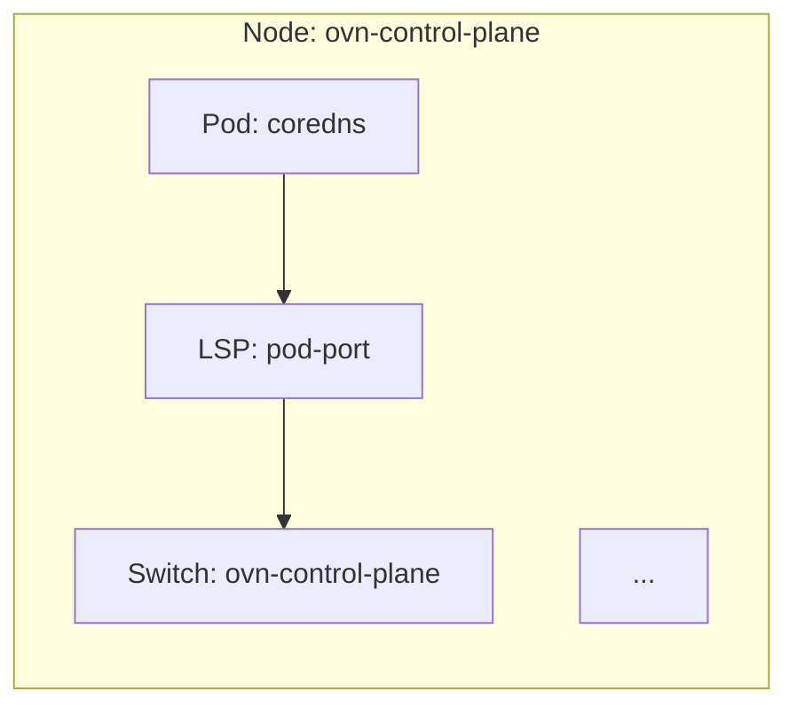

# OVN Topology Visualization

Generate and visualize OVN-Kubernetes network topology diagrams showing the complete logical network architecture.

## Overview

The `/openshift:visualize-ovn-topology` command automatically discovers your OVN-Kubernetes cluster architecture and generates a comprehensive Mermaid diagram showing:

- **Logical switches and routers** with subnets and IP ranges
- **Switch and router ports** with MAC/IP addresses
- **Pod connectivity** across the network stack
- **Gateway routers** and external network connections
- **Per-node component placement** (interconnect mode) or centralized components (default mode)

The command is **read-only** and performs no cluster modifications.

## Quick Start

### Prerequisites

- **kubectl**: Installed and configured with access to an OVN-Kubernetes cluster
- **Cluster access**: Read permissions for the `ovn-kubernetes` namespace
- **OVN-Kubernetes**: A running Kubernetes cluster with OVN-Kubernetes CNI

### Basic Usage

Simply run the command - it will automatically detect your cluster:

```
/openshift:visualize-ovn-topology
```

The command will:
1. 🔍 Detect your OVN-Kubernetes cluster across all kubeconfig contexts
2. 🔐 Check your permissions and warn if you have admin access
3. 📊 Analyze the cluster architecture (interconnect vs default mode)
4. 📥 Collect topology data from all nodes
5. 🎨 Generate a Mermaid diagram
6. 💾 Save to `ovn-topology-diagram.md`

### Example Output

```
✅ Successfully generated OVN-Kubernetes topology diagram

📄 Diagram saved to: ovn-topology-diagram.md

Summary:
- 3 nodes (ovn-control-plane, ovn-worker, ovn-worker2)
- 12 logical switches, 6 logical routers
- 32 logical switch ports, 15 logical router ports
- 17 running pods
- Mode: Interconnect (distributed control plane)

💡 Open the file in your IDE to view the full rendered Mermaid diagram!
```

## What Gets Visualized

### Network Topology Layers (Bottom-to-Top)

The diagram shows the complete network stack for each node:

1. **Pod Layer** - Running pods with their IPs and namespaces
2. **Logical Switch Ports (LSPs)** - Pod network interfaces with MAC addresses
3. **Node Switches** - Per-node logical switches with subnets
4. **Cluster Router** - Central routing component (per-node in interconnect mode)
5. **Join Switch** - Connects cluster router to gateway router
6. **Gateway Router** - Handles external connectivity and NAT
7. **External Switch** - Connects to physical network
8. **Physical Network** - Bridge to node's external network

### Cluster Modes

**Interconnect Mode** (Distributed):
- Each node runs its own OVN NBDB
- Per-node instances of cluster routers, join switches, etc.
- Transit switch interconnects nodes (shown at top of diagram)

**Default Mode** (Centralized):
- Single cluster-wide OVN NBDB
- Centralized cluster router and join switch
- Simpler topology for smaller clusters

## Security & Safety

### Read-Only Operations

This command performs **ONLY read-only operations**:

✅ **What it does:**
- `kubectl get` - Query pods and nodes
- `kubectl exec` - Run read-only `ovn-nbctl list` commands
- Local file writes - Save diagram to disk

❌ **What it NEVER does:**
- `kubectl create/delete/patch/apply` - No resource modifications
- `ovn-nbctl` modifications - No OVN database changes
- Pod restarts or service disruptions

### Permission Checking

If you have cluster admin permissions, the command will:
1. Detect write permissions before starting
2. Display exactly what permissions you have
3. Explain that only read-only operations will be performed
4. Ask for your explicit consent to proceed

This ensures **informed consent** - you're always aware when admin credentials are accessible.

## Output Format

### Generated Diagram

The command creates a Mermaid diagram in Markdown format:

```markdown
# OVN-Kubernetes Network Topology

## Architecture Summary
- Mode: Interconnect
- Nodes: 3
- Logical Switches: 12
...

## Topology Diagram



### Viewing the Diagram

**In VS Code / Claude Code:**
- Open `ovn-topology-diagram.md`
- Diagram renders automatically in preview pane

**In GitHub:**
- Diagrams render automatically in markdown preview

**Export to Image:**
- Use Mermaid CLI or online editors to export PNG/SVG

## Cluster Detection

The command intelligently finds OVN-Kubernetes clusters:

### Automatic Discovery

Scans multiple kubeconfig sources in order:
1. Current `KUBECONFIG` environment variable
2. `~/.kube/kind-config` (KIND clusters)
3. `~/ovn.conf` (OVN-specific configs)
4. `~/.kube/config` (default kubeconfig)

### Multi-Context Support

- Tests **all contexts** in each kubeconfig file
- Detects OVN-Kubernetes by checking for `ovnkube-node` pods
- If multiple clusters found, prompts you to choose
- Automatically switches to selected context

### Manual Cluster Selection

If auto-detection fails or you want to specify a cluster:
1. Set `KUBECONFIG` environment variable to your config
2. Ensure current context points to OVN cluster
3. Run the command

## Architecture Discovery

The command automatically detects your cluster's architecture:

### Interconnect Mode Detection

Analyzes UUID patterns across node databases:
- Queries each node's NBDB for component UUIDs
- Compares UUIDs to determine per-node vs cluster-wide components
- If same component has different UUIDs on each node → Interconnect mode
- If same component has same UUID everywhere → Default mode

### Component Placement

Based on architecture analysis:
- **Per-node components** → shown inside node subgraphs
- **Cluster-wide components** → shown outside nodes
- **Transit switch** → shown cluster-wide for visual clarity (even though per-node)

## Troubleshooting

### "No OVN-Kubernetes clusters found"

**Cause**: No kubeconfig with OVN clusters detected

**Solutions**:
1. Verify cluster is running: `kubectl get pods -n ovn-kubernetes`
2. Check current context: `kubectl config current-context`
3. Set kubeconfig explicitly: `export KUBECONFIG=/path/to/config`
4. Verify OVN pods exist: `kubectl get pods -n ovn-kubernetes -l app=ovnkube-node`

### "Permission denied" or "Forbidden"

**Cause**: Insufficient RBAC permissions

**Solutions**:
1. Verify you can list pods: `kubectl get pods -n ovn-kubernetes`
2. Verify you can exec: `kubectl exec -n ovn-kubernetes <pod> -- ovn-nbctl --version`
3. Contact cluster admin to grant read access to `ovn-kubernetes` namespace

Required permissions:
- `get`, `list` on pods in `ovn-kubernetes` namespace
- `create` on `pods/exec` (to run read-only commands inside pods)

### "File already exists"

**Cause**: `ovn-topology-diagram.md` already exists in current directory

**Solutions**:
The command will prompt you to:
1. Overwrite existing file
2. Save to a different location
3. Append timestamp to filename (e.g., `ovn-topology-diagram-20251103.md`)
4. Cancel operation

### Diagram appears cluttered or overlapping

**Cause**: Large cluster with many nodes/pods

**Solutions**:
1. View diagram in full-screen mode
2. Focus on specific nodes (hide others manually in Mermaid)
3. Export to SVG and use vector graphics viewer for zooming
4. Consider generating separate diagrams per node

### "kubectl exec failed" errors

**Cause**: OVN pods not ready or connectivity issues

**Solutions**:
1. Check pod status: `kubectl get pods -n ovn-kubernetes`
2. Wait for pods to be ready
3. Check node status: `kubectl get nodes`
4. Verify cluster connectivity: `kubectl cluster-info`

## Advanced Usage

### Custom Output Location

The command will prompt if output file exists. You can choose a custom location when prompted.

### Cluster Selection

If multiple OVN clusters are detected, you'll see:

```
Found 2 OVN-Kubernetes clusters:

1. Cluster: production (context: prod-ovn)
   Nodes: 10

2. Cluster: development (context: dev-ovn)
   Nodes: 3

Select cluster [1-2]:
```

### Performance Considerations

**Small Clusters (1-10 nodes)**: ~20-40 seconds
**Medium Clusters (10-50 nodes)**: ~1-3 minutes
**Large Clusters (50+ nodes)**: ~5-10 minutes

Time scales linearly with node count.

## Understanding the Output

### Diagram Legend

- **Solid arrows** (`→`): Layer-to-layer connections in the network stack
- **Dashed arrows** (`-.->|peer|`): Router-to-switch peer port relationships
- **Colors**:
  - 🟢 Green: Pods (traffic sources/destinations)
  - 🟠 Orange: Logical switches (layer 2)
  - 🟡 Yellow: Logical routers (layer 3)
  - 🔵 Blue: Switch ports (LSPs)
  - 🟣 Purple: Router ports (LRPs)
  - ⚫ Gray: External network bridges

### Key Information Shown

For each component, the diagram displays:

- **Pods**: Name, namespace, IP address
- **Switches**: Name, subnet/CIDR
- **Routers**: Name, role (cluster/gateway)
- **Ports**: Name, MAC address, IP address, type
- **External Network**: Physical bridge name, node IP

## FAQ

**Q: Does this modify my cluster?**
A: No. The command only reads cluster state - no modifications are made.

**Q: Will this work with non-OVN CNIs?**
A: No. This command specifically visualizes OVN-Kubernetes topology.

**Q: Can I run this on a production cluster?**
A: Yes. All operations are read-only and lightweight. Be mindful however if you have write access to the cluster. Verify the commands the AI is proposing to run (even if this skill is supposed to be read-only).

**Q: How often should I regenerate the diagram?**
A: Whenever cluster topology changes (nodes added/removed, pods scaled, etc.)

**Q: Can I customize the diagram appearance?**
A: Yes. Edit the generated `.md` file - modify Mermaid syntax for colors, layout, etc.

**Q: Does this capture load balancers?**
A: Currently focuses on switches, routers, and ports. Load balancer support may be added in future versions.

**Q: What's the difference between interconnect and default mode?**
A:
- **Interconnect**: Each node has own NBDB, better scalability, more complex
- **Default**: Centralized NBDB, simpler, better for smaller clusters

## Files Created

The command creates these temporary files during execution (automatically cleaned up):

```
$TMPDIR/ovn_switch_placement.txt      # Component placement analysis
$TMPDIR/ovn_router_placement.txt      # Component placement analysis
$TMPDIR/ovn_pods_detail.txt           # Pod information
$TMPDIR/ovn_switches_detail.txt       # Switch data
$TMPDIR/ovn_routers_detail.txt        # Router data
$TMPDIR/ovn_lsps_detail.txt           # Logical switch port details
$TMPDIR/ovn_lrps_detail.txt           # Logical router port details
```

Where `$TMPDIR` is a private temporary directory created by the orchestrator (typically under `/tmp`). This follows secure temporary file practices by isolating files in a caller-provided directory rather than using hardcoded paths.

All temporary files are removed after diagram generation completes.

## Technical Details

For AI agents and developers, see:
- **Implementation details**: [SKILL.md](SKILL.md)
- **Helper scripts**: [scripts/](scripts/)

## Support

For issues or questions:
- **Repository**: https://github.com/openshift-eng/ai-helpers
- **Issues**: https://github.com/openshift-eng/ai-helpers/issues

## License

See repository [LICENSE](../../../../LICENSE) file.
