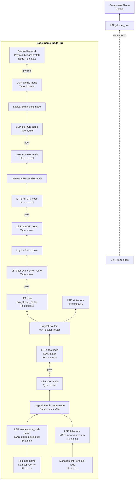

# Quick Start - OVN Topology Generation

**IMMEDIATE ACTIONS** (follow these steps in order):

1. **Detect Cluster**: Find the OVN-Kubernetes cluster kubeconfig

   Run: `scripts/detect-cluster.sh 2>/dev/null`

   The script discovers OVN-Kubernetes clusters:
   - Scans all kubeconfig files: current KUBECONFIG env, ~/.kube/kind-config, ~/ovn.conf, ~/.kube/config
   - Tests ALL contexts in each kubeconfig (not just current-context)
   - Returns parseable list to stdout: `index|kubeconfig|cluster_name|node_count|namespace`
   - Diagnostics go to stderr
   - Exit code: 0=success, 1=no clusters found

   **How to handle the output:**

   The script returns pipe-delimited lines to stdout, one per cluster found, e.g.:
   ```text
   1|/home/user/.kube/kind-config|kind-ovn|3|ovn-kubernetes
   2|/home/user/.kube/config|prod-cluster|12|openshift-ovn-kubernetes
   ```

   **Decision logic:**
   - If **one cluster** found → automatically use it (extract kubeconfig path from column 2)
   - If **multiple clusters** found → show the list to user and ask them to choose by number
   - After selection, extract the kubeconfig path from column 2 of the chosen line
   - Store the selected kubeconfig path in variable `KC` for use in subsequent steps

   **Example output format parsing:**
   - Column 1: Index number (for user selection)
   - Column 2: Kubeconfig file path (this is what you need for `$KC`)
   - Column 3: Cluster display name
   - Column 4: Number of nodes
   - Column 5: OVN namespace name

   **Important**: Parse the output using standard text processing. The exact implementation is up to you - use whatever approach works best (awk, Python, inline parsing, etc.).

2. **Check Permissions**: Verify user's Kubernetes access level and inform about write permissions

   Run: `scripts/check_permissions.py "$KC"`

   The script returns:
   - **Exit 0**: Read-only access or user confirmed → proceed
   - **Exit 1**: Error or user cancelled → stop
   - **Exit 2**: Write permissions detected → AI must ask user for confirmation

   **When exit code 2 is returned:**
   1. Parse the stdout to get the list of write permissions
   2. Display the permissions clearly to the user using a formatted message
   3. Explain that:
      - This skill performs ONLY read-only operations
      - No cluster modifications will be made
      - The warning is for transparency about their access level
      - List read-only operations: kubectl get, kubectl exec (ovn-nbctl list), local file writes
      - List forbidden operations: kubectl create/delete/patch, ovn-nbctl modifications
   4. **Ask the user explicitly**: "You have cluster admin permissions. This command will only perform read-only operations. Do you want to proceed?"
   5. If user says yes → continue, if no → stop

   **Example of proper user communication:**
   ```text
   ⚠️  WARNING: Write Permissions Detected

   Your kubeconfig has cluster admin permissions:
     • Delete pods, deployments, services
     • Create and modify resources
     • Full cluster access

   📋 IMPORTANT:
   This command will ONLY perform read-only operations:
     ✅ kubectl get (pods, nodes)
     ✅ kubectl exec (to run read-only ovn-nbctl list commands)
     ✅ Local file writes (topology diagram)

   Operations that will NEVER be performed:
     ❌ kubectl create/delete/patch/apply
     ❌ ovn-nbctl modifications
     ❌ Any cluster state changes

   Do you want to proceed with read-only topology generation?
   ```

   **Security Note**: This step ensures informed consent. The user must be explicitly aware that their cluster admin credentials are accessible to the AI agent (acting on their behalf), even though only read-only operations will be performed. This transparency is critical for security and trust.

3. **Check Output File**: Ask user if `ovn-topology-diagram.md` exists:
   - (1) Overwrite, (2) Custom path, (3) Timestamp, (4) Cancel

4. **Create Private Temp Directory**: Create a private temporary directory using `mkdtemp` and use it for all temporary files.

   ```bash
   TMPDIR=$(mktemp -d)
   ```

5. **Collect OVN Data**: Get full topology data from the cluster

   Run: `scripts/collect_ovn_data.py "$KC" "$TMPDIR"`

   Detail files written to `$TMPDIR`:
   - `ovn_switches_detail.txt` - node|uuid|name|other_config
   - `ovn_routers_detail.txt` - node|uuid|name|external_ids|options
   - `ovn_lsps_detail.txt` - node|name|addresses|type|options
   - `ovn_lrps_detail.txt` - node|name|mac|networks|options
   - `ovn_pods_detail.txt` - namespace|name|ip|node

6. **Analyze Placement**: Determine per-node vs cluster-wide components

   Run: `scripts/analyze_placement.py "$TMPDIR"`

   Placement results written to `$TMPDIR`:
   - `ovn_switch_placement.txt` - name|placement (per-node|cluster-wide|cluster-wide-visual)
   - `ovn_router_placement.txt` - name|placement (per-node|cluster-wide|cluster-wide-visual)

7. **Generate Diagram**: Create Mermaid `graph BT` diagram
   - Read `$TMPDIR/ovn_switch_placement.txt` to determine where each switch goes
   - Read `$TMPDIR/ovn_router_placement.txt` to determine where each router goes
   - Read detail files directly (ovn_switches_detail.txt, ovn_routers_detail.txt, etc.)
   - Skip UUID column when parsing switches/routers detail files
   - If placement is `per-node` → put inside node subgraph
   - If placement is `cluster-wide` or `cluster-wide-visual` → put outside subgraphs

8. **Save & Report**: Write diagram to file, show summary, clean up temporary files

**CRITICAL RULES**:
- ❌ NO codebase searching for IPs/MACs
- ❌ NO synthetic/example data
- ❌ NO inline multi-line bash (use helper scripts)
- ❌ NO direct kubectl commands (must use helper scripts only)
- ✅ Use helper scripts for all kubectl interactions and architecture discovery
- ✅ **For helper scripts only**: If kubectl is required, use `KUBECONFIG="$KC" kubectl --kubeconfig="$KC"`
- ✅ **SECURITY**: Create private temp directory with `TMPDIR=$(mktemp -d)` - never use `/tmp` directly
- ✅ Temporary files use `$TMPDIR` (private directory created with mkdtemp)
- ✅ Clean up temporary files when done: `rm -rf "$TMPDIR"`

## Safety & Security Guarantees

### 🔒 Read-Only Operations

This skill performs **ONLY read-only operations** against your Kubernetes cluster. No cluster state is modified.

**Allowed Operations:**
- ✅ `kubectl get` - Query resources
- ✅ `kubectl exec ... ovn-nbctl list` - Query OVN database (read-only)
- ✅ Local file writes (temporary files in `$TMPDIR`, output diagram)

**Forbidden Operations (NEVER used):**
- ❌ `kubectl create/apply/delete/patch` - No resource modifications
- ❌ `kubectl scale/drain/cordon` - No cluster operations
- ❌ `ovn-nbctl create/set/add/remove/destroy` - No OVN modifications
- ❌ No pod restarts or service disruptions

**Privacy Consideration**: The generated diagram contains network topology information. Control sharing appropriately based on your security policies.

---

# Architecture Concepts

## Interconnect Mode (Distributed NBDB)

In **interconnect mode**, each node runs its own NBDB with local copies of components:

**Per-Node Components** (different UUIDs on each node):
- `ovn_cluster_router` - Each node has its own cluster router instance
- `join` switch - Each node has its own join switch instance
- `transit_switch` - Each node has its own transit switch instance
- Node switches (e.g., `ovn-control-plane`, `ovn-worker`)
- External switches (e.g., `ext_ovn-control-plane`)
- Gateway routers (e.g., `GR_ovn-control-plane`)

**Visualization Overrides**:
- `transit_switch`: PER-NODE in reality → shown CLUSTER-WIDE for visualization clarity
- `join`: PER-NODE → kept PER-NODE (no override)

## Helper Scripts

All helper scripts are in the `scripts/` directory.

| Script | Purpose | Input | Output |
|--------|---------|-------|--------|
| [detect-cluster.sh](scripts/detect-cluster.sh) | Find OVN cluster kubeconfig across all contexts. Scans multiple kubeconfig files and all their contexts. Returns parseable list. | None | Parseable list to stdout: `index\|kubeconfig\|cluster\|nodes\|namespace`. Exit: 0=success, 1=none found |
| [check_permissions.py](scripts/check_permissions.py) | Check user permissions and warn if write access detected. | KUBECONFIG path | Exit: 0=proceed, 1=cancelled/error, 2=write perms (needs user confirmation) |
| [collect_ovn_data.py](scripts/collect_ovn_data.py) | **Data collector**: Queries each node for all data, with **graceful degradation** (continues on node failures). Writes detail files. | KUBECONFIG path, TMPDIR | Detail files: `ovn_switches_detail.txt`, `ovn_routers_detail.txt`, `ovn_lsps_detail.txt`, `ovn_lrps_detail.txt`, `ovn_pods_detail.txt` |
| [analyze_placement.py](scripts/analyze_placement.py) | **Placement analyzer**: Analyzes UUID patterns from detail files to determine per-node vs cluster-wide placement. | TMPDIR (reads detail files) | Placement files: `ovn_switch_placement.txt`, `ovn_router_placement.txt` |

---

# Diagram Generation Rules

## Structure



## Key Requirements

1. **Graph Direction**: Always `graph BT` (bottom-to-top)

2. **Component Placement**: Determined by `$TMPDIR/ovn_*_placement.txt`
   - `per-node` → INSIDE node subgraph
   - `cluster-wide` or `cluster-wide-visual` → OUTSIDE all subgraphs, **defined AFTER all node subgraphs**
   - **CRITICAL**: Define ALL cluster-wide components AFTER all nodes to position them at the TOP
     - Prevents connection lines from overlapping with node subgraphs
     - Applies to ANY component with `cluster-wide` or `cluster-wide-visual` placement

3. **Node Subgraphs**: Each physical node gets a subgraph with `direction BT`
   - **Node Ordering**: ALWAYS order nodes as: control-plane node first, then worker nodes sorted alphabetically by name
   - Title format: `"<b style='color:black'>Node: {node_name} ({external_ip})</b>"`
   - Get external IP from `rtoe-GR_{node}` router port network field
   - Use different background colors for each node for visual distinction
   - **CRITICAL: Define components in BOTTOM-TO-TOP order** (matches packet flow):
     1. **Bottom Layer**: Pods and Management Ports (traffic originates here)
     2. **Layer 2**: Pod LSPs
     3. **Layer 3**: Node Switch (where pods connect)
     4. **Layer 4**: Node Switch LSPs (stor, breth0)
     5. **Layer 5**: Cluster Router + Router Ports (rtos, rtoj, rtots)
     6. **Layer 6**: Join Switch + Join LSPs
     7. **Layer 7**: Gateway Router + Router Ports (rtoj, rtoe)
     8. **Layer 8**: External Switch + External LSPs (etor, breth0)
     9. **Top Layer**: External Network (physical bridge)

4. **Pod Representation**:
   - **CRITICAL**: Show ALL pods from `$TMPDIR/ovn_pods_detail.txt` as SEPARATE entities
   - **DO NOT** discover pods from LSPs - many pods (host-network) don't have individual LSPs
   - Pod format: `POD_{id}["Pod: {name}<br/>Namespace: {ns}<br/>IP: {ip}"]`
   - Connect pods to their respective LSPs:
     - **Host-network pods** (IP == node IP): `POD_{id} --> MGMT_{node} --> LSP_k8s_{node}`
     - **Pod-network pods** (IP in 10.244.x.x): `POD_{id} --> LSP_{namespace}_{podname}`

5. **Physical Network Layer**:
   - Show explicit external network entities per node
   - Format: `EXT_NET_{node}["External Network<br/>Physical bridge: breth0<br/>Node IP: {external_ip}"]`
   - Connect localnet LSPs to external network: `LSP_breth0_{node} -.->|physical| EXT_NET_{node}`

6. **Colors** (apply using classDef with **color:#000** for black text):
   - Pods: `fill:#e8f5e9,stroke:#2e7d32,stroke-width:2px,color:#000`
   - Switches: `fill:#fff3e0,stroke:#e65100,stroke-width:2px,color:#000`
   - Routers: `fill:#fff9c4,stroke:#f57f17,stroke-width:2px,color:#000`
   - LSPs (ALL types): `fill:#e3f2fd,stroke:#1565c0,stroke-width:2px,color:#000`
   - LRPs: `fill:#f3e5f5,stroke:#6a1b9a,stroke-width:2px,color:#000`
   - External Network: `fill:#e0e0e0,stroke:#424242,stroke-width:2px,color:#000`
   - Management Ports (MGMT entities only, not LSPs): `fill:#fff8e1,stroke:#f57c00,stroke-width:2px,color:#000`
   - **Node Subgraph Backgrounds** (use `style` statements, NOT classDef): Apply at END of diagram after all class assignments. Rotate through these 3 colors:
     - Node 1 (index 0): `style node1 fill:#e8f5e9,stroke:#2e7d32,stroke-width:3px,stroke-dasharray: 5 5,color:#000` (green)
     - Node 2 (index 1): `style node2 fill:#e1f5fe,stroke:#0277bd,stroke-width:3px,stroke-dasharray: 5 5,color:#000` (blue)
     - Node 3 (index 2): `style node3 fill:#fff3e0,stroke:#ef6c00,stroke-width:3px,stroke-dasharray: 5 5,color:#000` (orange)
     - Node 4+ repeats: Use index % 3 to rotate colors (0=green, 1=blue, 2=orange)

7. **Required Info**:
   - Pods: Name, Namespace, IP
   - Switches: Name, Subnet (from other_config), Gateway (optional)
   - LSPs: Name, MAC, IP (or Type + Router Port for router ports)
   - LRPs: Name, MAC, Network (IP/CIDR)
   - Routers: Name, Description
   - External Network: Physical bridge name (breth0), Node IP

8. **Connections**:
   - Solid arrows: Layer connections
   - Dashed arrows with `|peer|`: Peer port relationships

## Pod Discovery

**CRITICAL: Discover pods from `$TMPDIR/ovn_pods_detail.txt`, NOT from LSPs**

The file `$TMPDIR/ovn_pods_detail.txt` contains ALL running pods in the cluster (populated by collect_ovn_data.py).
Format: `namespace|pod_name|pod_ip|node_name`

**Pod-to-LSP Mapping Logic:**

1. **Read ALL pods** from `$TMPDIR/ovn_pods_detail.txt`
2. **For each pod**, determine which LSP it connects to:

   a. **Host-Network Pods** (pod IP == node IP, e.g., 10.89.0.10):
      - **Connect to management port LSP**: `k8s-{node}`
      - These pods share the management port's IP address
      - **MUST be included in diagram** despite not having individual LSPs

   b. **Pod-Network Pods** (pod IP in pod network range, e.g., 10.244.x.x):
      - **Connect to individual LSP**: `{namespace}_{pod-name-with-hash}`
      - LSP name format: `kube-system_coredns-674b8bbfcf-qhfrq`
      - Filter LSPs where `type=""` (empty string)
      - Extract MAC and IP from LSP addresses field

3. **Diagram representation**:
   ```mermaid
   POD_id["Pod: {name}<br/>Namespace: {ns}<br/>IP: {ip}"]
   POD_id --> LSP_id
   ```

**Special LSPs (NOT pods, treat as infrastructure):**
- `k8s-{node}`: Management port LSP (multiple host-network pods connect to this)
- `stor-{node}`: Router port (type="router")
- `breth0_{node}`: LocalNet port (type="localnet")
- `jtor-*`, `etor-*`, `tstor-*`: Router ports (type="router")

### Example: Control Plane Node with Host-Network Pods

```mermaid
%% 8 host-network pods sharing management port
POD_etcd["Pod: etcd-ovn-control-plane<br/>Namespace: kube-system<br/>IP: 10.89.0.10"]
POD_apiserver["Pod: kube-apiserver-ovn-control-plane<br/>Namespace: kube-system<br/>IP: 10.89.0.10"]
POD_controller["Pod: kube-controller-manager-ovn-control-plane<br/>Namespace: kube-system<br/>IP: 10.89.0.10"]
POD_scheduler["Pod: kube-scheduler-ovn-control-plane<br/>Namespace: kube-system<br/>IP: 10.89.0.10"]
POD_ovnkube_cp["Pod: ovnkube-control-plane-ovn-control-plane<br/>Namespace: ovn-kubernetes<br/>IP: 10.89.0.10"]
POD_ovnkube_id["Pod: ovnkube-identity-ovn-control-plane<br/>Namespace: ovn-kubernetes<br/>IP: 10.89.0.10"]
POD_ovnkube_node["Pod: ovnkube-node-xyz<br/>Namespace: ovn-kubernetes<br/>IP: 10.89.0.10"]
POD_ovs_node["Pod: ovs-node-xyz<br/>Namespace: ovn-kubernetes<br/>IP: 10.89.0.10"]

%% Management port LSP (shared by all host-network pods)
MGMT_cp["Management Port: k8s-ovn-control-plane<br/>IP: 10.89.0.10"]
LSP_mgmt["LSP: k8s-ovn-control-plane<br/>MAC: xx:xx:xx:xx:xx:xx<br/>IP: 10.244.0.2"]

%% All host-network pods connect to same management port
POD_etcd --> MGMT_cp
POD_apiserver --> MGMT_cp
POD_controller --> MGMT_cp
POD_scheduler --> MGMT_cp
POD_ovnkube_cp --> MGMT_cp
POD_ovnkube_id --> MGMT_cp
POD_ovnkube_node --> MGMT_cp
POD_ovs_node --> MGMT_cp

MGMT_cp --> LSP_mgmt --> LS_node
```

---

# Final Steps

1. Generate complete Mermaid diagram following structure above
2. Save to file chosen by user
3. Show summary: nodes, switches, routers, ports, mode
4. Clean up temporary directory:
   ```bash
   rm -rf "$TMPDIR"
   ```
5. Tell user to open file in IDE to view rendered diagram
